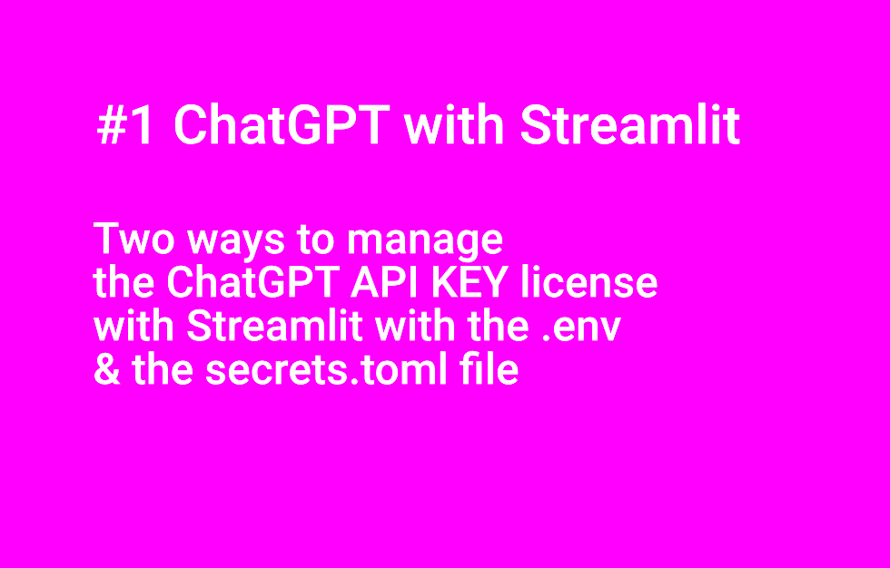
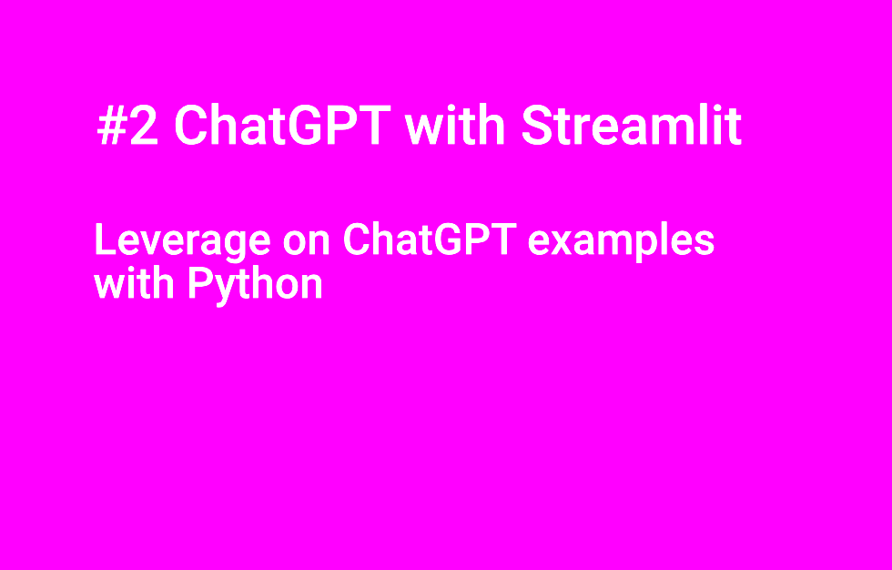
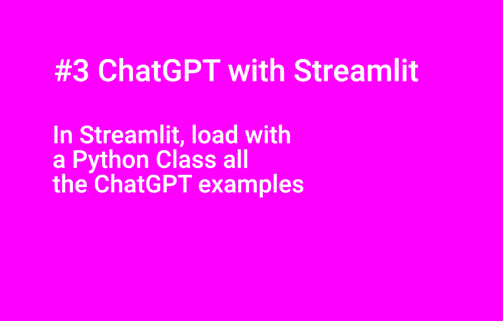

# ai_chatgpt_prompts


**Some ideas on the probable future of journalism facing IA and how to create a prompt facilitation application for ChatGPT with Streamlit.**


[Read more on flaven.fr: https://flaven.fr/2023/07/some-ideas-on-the-probable-future-of-journalism-facing-ia-and-how-to-create-a-prompt-facilitation-application-for-chatgpt-with-streamlit/](https://flaven.fr/2023/07/some-ideas-on-the-probable-future-of-journalism-facing-ia-and-how-to-create-a-prompt-facilitation-application-for-chatgpt-with-streamlit/)


## EXPLANATIONS
- ai_chatgpt_prompts_requirements.txt: the requirements to load the environment `ai_chatgpt_prompts_requirements.txt`.
- extras_files: some secondary scripts.
- project_1_python_documentation_chatgpt_api: Some unique examples with ChatGPT API with Python.
- project_2_node_documentation_chatgpt_api: Exploration of the  ChatGPT API with Node.
- project_3_streamlit: Few attempts to query ChatGPT with the help of Streamlit. Check the Python Class in `010_project_3_python_streamlit_app_chatgpt_api.py` to enable an easy query of the ChatGPT API.
- project_4_chainlit: Few attempts to query ChatGPT API with the help of Chainlit 


## VIDEOS


[#1 ChatGPT with Streamlit: Two ways to manage the ChatGPT API KEY license with Streamlit with the .env & the secrets.toml file](https://www.youtube.com/watch?v=ytI8QDiA6dw)[](https://www.youtube.com/watch?v=ytI8QDiA6dw)

[#2 ChatGPT with Streamlit: Leverage on ChatGPT examples with Python](https://www.youtube.com/watch?v=4WlFRNyyHnY)[](https://www.youtube.com/watch?v=4WlFRNyyHnY)


[#3 ChatGPT with Streamlit: In Streamlit, load with a Python Class all the ChatGPT examples](https://www.youtube.com/watch?v=qPxADJ7JWGI)[](https://www.youtube.com/watch?v=qPxADJ7JWGI)


[#4 ChatGPT with Streamlit: In Streamlit, load with a Python Class all the ChatGPT examples](https://www.youtube.com/watch?v=eauteYKUGm0)[](https://www.youtube.com/watch?v=eauteYKUGm0)


## DIRECTORY LISTING

```bash

.
├── README.md
├── ai_chatgpt_prompts_requirements.txt
├── extras_files
│   ├── 001_modify_data.py
│   └── 002_modify_data.py
├── project_1_python_documentation_chatgpt_api
│   ├── 001_project_1_python_documentation_chatgpt_api.py
│   ├── 003_project_1_python_documentation_default_product_name_gen_chatgpt_api.py
│   ├── 004_project_1_python_documentation_default_qa_chatgpt_api.py
│   ├── 005_project_1_python_documentation_default_summarize_chatgpt_api.py
│   ├── 006_project_1_python_documentation_default_summarize_chatgpt_api.py
│   ├── 007_project_1_python_documentation_default_summarize_chatgpt_api.py
│   ├── 008_project_1_python_documentation_spreadsheet_creator_chatgpt_api.py
│   ├── 009_project_1_python_documentation_default_translate_code_chatgpt_api.py
│   ├── 010_project_1_python_documentation_default_python_bug_fixer_chatgpt_api.py
│   ├── 011_project_1_python_documentation_default_notes_to_summary_chatgpt_api.py
│   ├── 012_project_1_python_documentation_default_movie_to_emoji_chatgpt_api.py
│   ├── 013_project_1_python_documentation_parse_unstructured_data_chatgpt_api.py
│   ├── 014_project_1_python_documentation_classification_chatgpt_api.py
│   ├── 015_project_1_python_documentation_python_to_natural_language_chatgpt_api.py
│   ├── 016_project_1_python_documentation_extract_keywords_chatgpt_api.py
│   ├── 017_project_1_python_documentation_translate_chatgpt_api.py
│   ├── 018_project_1_python_documentation_default_explain_code_code_chatgpt_api.py
│   └── 019_project_1_python_documentation_tl_dr_summarization_chatgpt_api.py
├── project_2_node_documentation_chatgpt_api
│   ├── 001_async_function.js
│   ├── 001_node_documentation_chatgpt_api.js
│   ├── 002_node_documentation_chatgpt_api.js
│   ├── 003_change_node_documentation_chatgpt_api.js
│   ├── 004_change_node_documentation_chatgpt_api.js
│   ├── allValues.js
│   ├── package-lock.json
│   └── package.json
├── project_3_streamlit
│   ├── 001_project_3_python_streamlit_app_chatgpt_api.py
│   ├── 002_project_3_python_streamlit_app_chatgpt_api.py
│   ├── 003_project_3_python_streamlit_app_chatgpt_api.py
│   ├── 004_project_3_python_streamlit_app_chatgpt_api.py
│   ├── 009_project_3_python_streamlit_app_chatgpt_api.py
│   ├── 010_project_3_python_streamlit_app_chatgpt_api.py
│   ├── config_values
│   │   └── values_conf.py
│   ├── test_1_buggy_function.py
│   ├── test_1_class_switch.py
│   ├── test_2_class_switch_streamlit.py
│   ├── test_3_class_switch_streamlit.py
│   ├── test_4_class_switch_streamlit.py
│   ├── test_5_class_switch_streamlit.py
│   └── test_6_class_switch_streamlit.py
└── project_4_chainlit
    ├── 001_chainlit_python.py
    ├── 002_chainlit_langchain_python.py
    ├── 004_chainlit_langchain_python_langchain_index.py
    ├── 005_chainlit_langchain_python_llama_index.py
    ├── chainlit.md
    ├── data
    │   └── state_of_the_union.txt
    └── storage
        ├── docstore.json
        ├── graph_store.json
        ├── index_store.json
        └── vector_store.json

8 directories, 54 files
```
