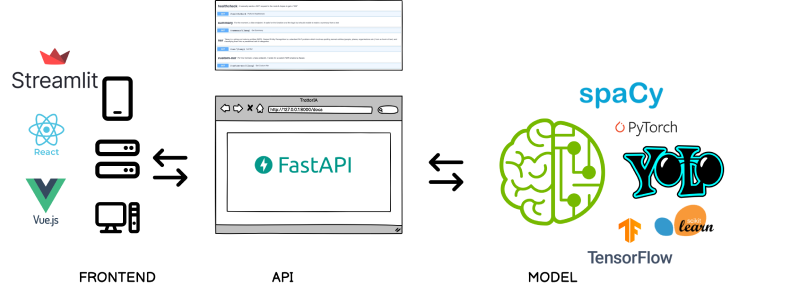
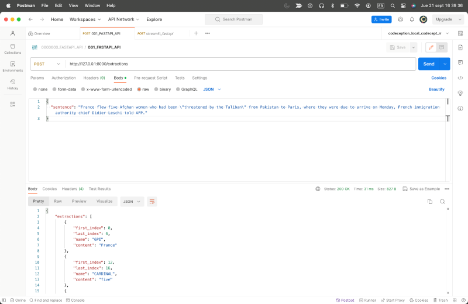
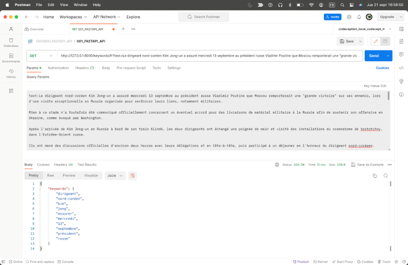
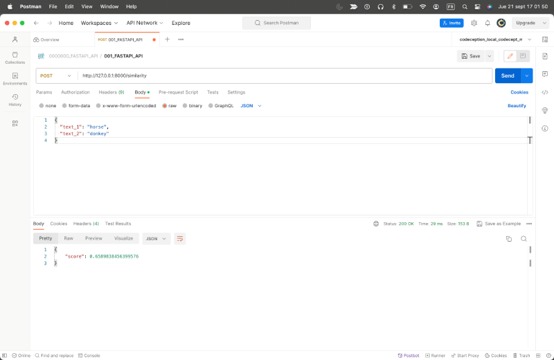
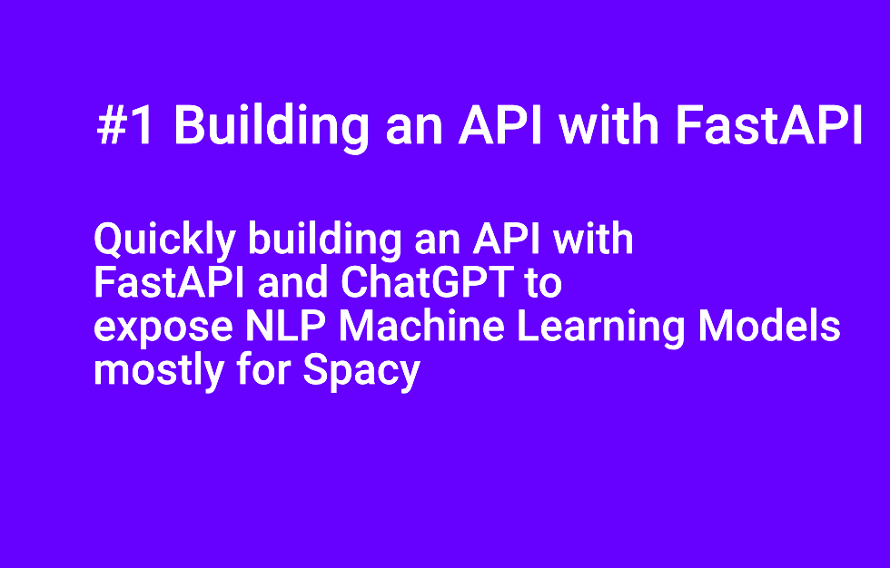
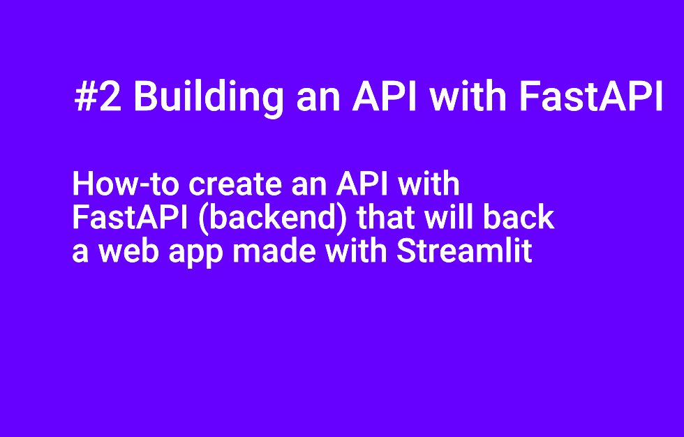
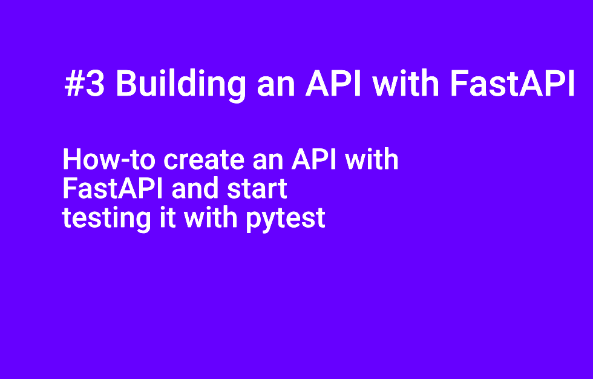

# fastapi_nlp_model

## Intro
An article exploring the ability to build a POC for an API, made with FastAPI. The objective is to expose ML app build & deployment locally first, especially with Spacy.

**You can read the article on my blog**
[How to expose NLP Machine Learning Models mostly for Spacy by quickly building an API with FastAPI and then play with them](https://flaven.fr/2023/09/how-to-expose-nlp-machine-learning-models-mostly-for-spacy-by-quickly-building-an-api-with-fastapi-and-then-play-with-them/)


**Note**
So, I have browse many projects especially those made with Spacy. The last one "017_chatGPT_fastapi_nlp_model" is one made both with the help of ChatGPT and the result of this exploration.

Here is the prompt below the "017_chatGPT_fastapi_nlp_model" project
> Write in python with the best practices a FastAPI that enable 4 languages with Spacy and provide four differents endpoints like summary function, "normal" NER function and “custom” NER function.

## FastAPI Projects Digest
**Here are a quick description per GitHub directory.**

- ### 002_bamimoretomi_spacy_fastapi:
An API's POC with FastAPI using libraries for NLP like NTLTK for text, in english only, with endpoints on similarity, synonyms, antonyms... And a endpoint "tospeech" that convert a text into audio with the library gTTS.


- ### 003_juliensalinas_spacy_fastapi:
A quick POC on Spacy from the founder of nlpcloud.com, that has evidently leverage on FastAPI.

- ### 004_shanealynn_spacy_fastapi:
A simple POC on Spacy and Flair.

- ### 006_analyticsindiamag_spacy_fastapi:
Very similar to the project 003.

- ### 008_anaconda_MKTR-ai_YT_Maj9v-Ev7-4:
A great video on Youtube with excellent explanations from a real professional. The project was initially using Poetry, I have used Anaconda but I gave the poetry file configuration and I just took the FastAPI API file. A must-seen as the video has its purpose is to go through a super quick ML app build & deployment.  You can see in cation a possible full workflow: from building to deploying an NLP / Machine Learning App with Poetry, FastAPI, Docker, Spacy & GCP. 

- ### 009_streamlit_fastapi_basic_calculator:
A very simple, educational and hybrid project that demonstrate how-to create an API with FastAPI (backend) that will backed a web app made with Streamlit. Nice source of inspiration and a basic illustration of the FRONTEND, API, MODEL workflow.

- ### 010_spacy_projects:
A more "advanced" API made with FastAPI taken from projects/integrations/fastapi/ in the explosion githib account, the company behind Spacy. See the full project <a href="https://github.com/explosion/projects/tree/v3/integrations/fastapi" target="_blank" rel="noopener">https://github.com/explosion/projects/tree/v3/integrations/fastapi</a>


- ### 011_cookiecutter_spacy_fastapi:
I only grab the API and the test (pytest) from this project. In reality, it is a bit more extended project, made by Microsoft's people to promote Azure platform, using cookiecutter. Here is the full description of the initial project: "A python cookiecutter API for quick deployments of spaCy models with FastAPI. The API interface is compatible with Azure Search Cognitive Skills."


- ### 012_fastapi_tiangolo_testing:
A sample to explore a bit more the testing. Quality is key. I have follow only the beginning just to ensure that testing with FastAPI  was easy. Extracted from "FastAPI Tutorial - User Guide - Testing" found at 
<a href="https://github.com/explosion/projects/tree/v3/integrations/fastapi" target="_blank" rel="noopener">https://fastapi.tiangolo.com/tutorial/testing/</a>


- ### 013_fastapi_datacamp:
Great article, Great source code, found at 
<a href="https://www.datacamp.com/tutorial/introduction-fastapi-tutorial" target="_blank" rel="noopener">https://www.datacamp.com/tutorial/introduction-fastapi-tutorial</a>. Gave a quick comparison between Django, Flask and FastAPI and also provide a good introduction to PyCaret "An open-source, low-code machine learning library in Python"


- ### 014_fastapi_kinsta:
A different kind of API that explore CRUD operations on Users, nothing to do with NLP! But this project gave precious advices on Routing, Code API logical organisation and so on.

- ### 017_chatGPT_fastapi_nlp_model:
I already mention this POC. The files are a mix between logical code written by ChatGPT (I have given the prompt in the main.py) and then extended by myself with the code grabbed during this exploration. The API has serve as a base for a presentation to expose ML app build & deployment in my company. It illustrate my belief "A pseudo product must always exist to become the very subject of discussion".


## Additional Resources


**A very basic workflow with the FastAPI's API future place (ml_fastapi_front_schema_small.png)**

[](https://flaven.fr/)


**Some capture screens to remember how to query an API made with FastAPI via postman this new API :) I always forget it.**

[](https://flaven.fr/)

[](https://flaven.fr/)

[](https://flaven.fr/)


## Videos


You can find my WALKTHROUGHS for these 3 videos walkthrough_fastapi_nlp_model.diff (Video #1, Video #2, Video #3)


[#1 How to expose NLP Machine Learning Models mostly for Spacy by quickly building an API with FastAPI](https://www.youtube.com/watch?v=o8NNzvVI0Ac)[](https://www.youtube.com/watch?v=o8NNzvVI0Ac)


[#2 #2 How-to create an API with FastAPI, backend for a web app made with Streamlit](https://www.youtube.com/watch?v=_gFFv61AWt4)[](https://www.youtube.com/watch?v=_gFFv61AWt4)

[#3 How-to create an API with FastAPI and start testing it with pytest](https://www.youtube.com/watch?v=W7mAMECbNsY)[](https://www.youtube.com/watch?v=W7mAMECbNsY)


## Code

**Some commands and operation modes are just here to be keep as archives and command lines.**

**SENTENCES_EXAMPLES**
```
# SENTENCES_EXAMPLES
# sentences_example_1
Apple is looking at buying U.K. startup for $1 billion

# sentences_example_2
Alphabet sets profit record, plans $50 billion buyback

# sentences_example_3
K-everything: the rise and rise of Korean culture: From music to movies, technology to food, the world has fallen in love with everything South Korean. Ahead of a big London exhibition, Tim Adams visits Seoul in search of the origins of hallyu – the Korean wave.

# Top 12 NLP Project Ideas in 2023 [with Source Code]
# https://www.knowledgehut.com/blog/data-science/nlp-projects


```
**010_spacy_projects**

```
# 010_spacy_projects :: Spacy Project

# create dir
cd /Users/brunoflaven/Documents/03_git/BlogArticlesExamples/fastapi_nlp_model/010_spacy_projects

# clone dir
git clone https://github.com/explosion/projects.git examples_from_spacy

# make testing dir
mkdir _testing_projects

# activate the env
source activate streamlit_fastapi


# complete the env with requirements
cd /Users/brunoflaven/Documents/03_git/BlogArticlesExamples/fastapi_nlp_model/010_spacy_projects/examples_from_spacy/

# Conda Environment
conda create --name streamlit_fastapi python=3.9.13
conda info --envs
source activate streamlit_fastapi
source activate streamlit_fastapi
conda deactivate

# to export requirements
pip freeze > requirements_fastapi_datacamp.txt

# to install
pip install -r requirements.txt


# check spacy
python -m spacy validate

# clone the spacy "ner_double" project
python -m spacy project clone tutorials/ner_double _testing_projects/ner_double

python -m spacy project clone integrations/fastapi _testing_projects/spacy_fastapi_integration

# fetch the assets
python -m spacy project assets _testing_projects/spacy_fastapi_integration

# go to the project's directory
cd /Users/brunoflaven/Documents/03_git/BlogArticlesExamples/fastapi_nlp_model/010_spacy_projects/_testing_projects/ner_double

# launch the project
python -m spacy project run start

```

**PROMPTS FOR CHATGPT**

```
# PROMPT_1 FOR CHATGPT FastAPI NLP API V2
# In python, can you write an API that load Spacy in French and enable the following endpoint "http://127.0.0.1:8000/api/extract_keywords" on the same URL. This endpoint "http://127.0.0.1:8000/api/extract_keywords" will be able to extract the keywords from a text so you need to write a function named extract keywords that retrieve the most used keywords inside a text.

# required package
pip install fastapi spacy

# install the FR version
python -m spacy download fr_core_news_sm

# to validate the spacy install
python -m spacy validate

```

```
# PROMPT_2 FOR CHATGPT FastAPI NLP API V2
Write in python with the best practices a FastAPI that enable 4 languages with Spacy and provide four differents endpoints like summary function, "normal" NER function and “custom” NER function.


# requirements
pip install fastapi[all] spacy
python -m spacy download en_core_web_sm
python -m spacy download es_core_news_sm
python -m spacy download fr_core_news_sm
python -m spacy download de_core_news_sm


# brief
# - Place multiple languages: FR, ES, EN, RU
# - functions available on the API built with FastAPI
# --- provide a summary function
# --- provide a keyword extraction function
# --- provide a "normal" NER function
# --- provide a “custom” NER function
```

**014_fastapi_kinsta**


```
# 014_fastapi_kinsta :: Build an App With FastAPI for Python

# http://127.0.0.1:8000/docs
# http://127.0.0.1:8000/
# http://127.0.0.1:8000/api/v1/users

# Example of json
{
  "first_name": "Jane",
  "last_name": "Campion",
  "gender": [
    "female"
  ],
  "roles": [
    "admin",
    "user"
  ]
}

# Source: https://kinsta.com/blog/fastapi/
```

**013_fastapi_datacamp**

```
# 013_fastapi_datacamp :: FastAPI Tutorial: An Introduction to Using FastAPI
# --- Source: https://www.datacamp.com/tutorial/introduction-fastapi-tutorial

# go to dir
cd /Users/brunoflaven/Documents/03_git/BlogArticlesExamples/fastapi_nlp_model/013_fastapi_datacamp/

# create env
[ENV]
# Conda Environment
conda create --name fastapi_datacamp python=3.9.13
conda info --envs
source activate fastapi_datacamp
conda deactivate

# install pycaret
pip install pycaret

# requirements
pip install accelerate==0.20.3
pip install pydantic==1.10.12

# launch pycaret to create a pycaret model with fastapi
python insurance_prediction_model.py

# Full Source for pycaret
# https://pycaret.gitbook.io/docs/
```

**011_cookiecutter_spacy_fastapi**

```
# 011_cookiecutter_spacy_fastapi :: Using FastAPI to Build Python Web APIs
# --- Source: https://github.com/microsoft/cookiecutter-spacy-fastapi/tree/master

# clone dir
git clone https://github.com/microsoft/cookiecutter-spacy-fastapi.git

# create env
[ENV]
# Conda Environment
conda create --name cookiecutter_spacy_fastapi_testing python=3.9.13
conda info --envs
source activate cookiecutter_spacy_fastapi_testing
source activate ner_service
conda deactivate

# if needed to remove
conda env remove -n [NAME_OF_THE_CONDA_ENVIRONMENT]
conda env remove -n cookiecutter_spacy_fastapi_testing

# to export requirements
pip freeze > requirements.txt
pip freeze > requirements_no_spacy.txt

# to install
pip install -r requirements.txt


# Using docker

# --- MODEL docker build -t mikenemke/ex-ner-service:latest .
# --- MODEL docker build -t bflaven/ex-ner-service:latest .
# command
docker build -t bflaven/spacy-fastapi-only:latest .


# --- MODEL docker run -d -p 80:80 mikenemke/ex-ner-service:latest
# --- MODEL docker run -d -p 80:80 bflaven/ex-ner-service:latest
# command
docker run -d -p 80:80 bflaven/spacy-fastapi-only:latest

# launch uvicorn
uvicorn main:app --reload


# leverage on the api
# Open your browser to http://localhost:8000/docs to view the OpenAPI UI.
# http://localhost:8000/docs
# http://localhost:8000/redoc


# for test add starlette in the requirements
pip install starlette
pip install httpx
pip install fastapi
pip install pytest

# other commands
pip show spacy
python -m spacy info
python -m spacy --version


# some commands for docker
docker ps
docker rm -f 

# remove image
docker rmi -f 99d8622e139f

docker ps -a                
# Lists containers (and tells you which images they are spun from)

docker images               
# Lists images 

docker rm <container_id>    
# Removes a stopped container

docker rm -f <container_id> 
# Forces the removal of a running container (uses SIGKILL)

docker rmi <image_id>       
# Removes an image 
# Will fail if there is a running instance of that image i.e. container

docker rmi -f <image_id>    
# Forces removal of image even if it is referenced in multiple repositories, 
# i.e. same image id given multiple names/tags 
# Will still fail if there is a docker container referencing image

```

**008_anaconda_MKTR-ai_YT_Maj9v-Ev7-4**

```

# 008_anaconda_MKTR-ai_YT_Maj9v-Ev7-4 :: Rapidly build & deploy an NLP / Machine Learning App with Poetry, FastAPI, Docker, Spacy & GCP
# --- Source: https://www.youtube.com/watch?v=Maj9v-Ev7-4

# - path
cd /Users/brunoflaven/Documents/03_git/BlogArticlesExamples/fastapi_nlp_model/008_anaconda_MKTR-ai_YT_Maj9v-Ev7-4

# launch the app
uvicorn main:app --reload


# INSTALL WITH ANACONDA (WAY_2)
mkdir 008_anaconda_MKTR-ai_YT_Maj9v-Ev7-4

[ENV_1]
# Conda Environment
conda create --name ner_service python=3.9.13
conda info --envs
source activate ner_service
conda deactivate

# if needed to remove
conda env remove -n [NAME_OF_THE_CONDA_ENVIRONMENT]
conda env remove -n ner_service


# update conda
conda update -n base -c defaults conda

# to export requirements
pip freeze > requirements_ner-service.txt
pip install -r requirements_ner-service.txt


# --- Source: https://www.youtube.com/watch?v=Maj9v-Ev7-4
# --- Code: https://github.com/JayThibs/spacy-example-deployed-service/tree/master
https://github.com/mrn18d/example-nlp-project

# check python version
python --version 


# INSTALL WITH POETRY (WAY_1)

# STEP_1 install poetry (method_2 via brew)
https://formulae.brew.sh/formula/poetry
brew install poetry
poetry --version


# STEP_2 NLP stuff
# - install the dir
mkdir 007_MKTR-ai_YT_Maj9v-Ev7-4
cd 007_MKTR-ai_YT_Maj9v-Ev7-4
mkdir ner-service

# - init poetry 
poetry init 
# --- Fill up the elements, say no to the 2 last questions

# - shell poetry 
poetry shell
# --- to go out from the env
exit

# - create files
mkdir src
cd src

touch __init__.py
touch main.py

# - install spacy 
# --- to go out from the env
exit
# --- install spacy
poetry add spacy
# --- install the nlp dependency
python -m spacy download en_core_web_sm

# - install fastapi
# --- install fastapi
poetry shell
poetry add fastapi
# --- install uvicorn
poetry add uvicorn

# - launch fastapi
uvicorn main:app --reload

# - get to the api
http://127.0.0.1:8000/docs


# CONTENT
# --- samples phrases from F24 EN
# General Brice Oligui Nguema, who led a coup last week that toppled Gabon's 55-year-old dynasty, took the oath of office as interim president on Monday, promising to hold "free... (and) transparent elections" after an unspecified period.
# https://www.france24.com/en/africa/20230904-gabon-coup-leader-general-oligui-to-be-sworn-in-as-transitional-president


# France flew five Afghan women who had been \"threatened by the Taliban\" from Pakistan to Paris, where they were due to arrive on Monday, French immigration authority chief Didier Leschi told AFP.
# https://www.france24.com/en/middle-east/20230904-france-evacuates-to-paris-five-afghan-women-threatened-by-taliban

# La France a transporté cinq Afghanes \"menacées par les talibans\" du Pakistan vers Paris, où elles devaient arriver lundi, a déclaré à l'AFP le chef des services français de l'immigration, Didier Leschi.
# Ivory Coast's ruling party appeared set for a landslide victory according to partial results Sunday from local elections expected to gauge support two years from presidential elections, electoral commission data showed.

# json model
{
  "data": [
    {
      "post_url": "string1",
      "content": "General Brice Oligui Nguema, who led a coup last week that toppled Gabon's 55-year-old dynasty, took the oath of office as interim president on Monday, promising to hold \"free... (and) transparent elections\" after an unspecified period."
    },
    {
      "post_url": "string2",
      "content": "France flew five Afghan women who had been \"threatened by the Taliban\" from Pakistan to Paris, where they were due to arrive on Monday, French immigration authority chief Didier Leschi told AFP."
    },
        {
      "post_url": "string3",
      "content": "Ivory Coast's ruling party appeared set for a landslide victory according to partial results Sunday from local elections expected to gauge support two years from presidential elections, electoral commission data showed."
    }
  ]
}

# STEP_2 NLP stuff
# ! Install WAY_2 using a pyproject.toml file completed

# - shell poetry 
poetry shell
# --- to go out from the env
exit

# - update poetry 
poetry update

# --- example_fr_1
{
  "data": [
    {
      "post_url": "string1",
      "content": "La France a transporté cinq Afghanes \"menacées par les talibans\" du Pakistan vers Paris, où elles devaient arriver lundi, a déclaré à l'AFP le chef des services français de l'immigration, Didier Leschi."
    }
  ]
}

# --- example_fr_2
{
  "data": [
    {
      "post_url": "string_fr_1",
      "content": "Le Premier ministre chinois, Li Qiang, conduira la délégation de Pékin lors de la réunion des dirigeants du G20 le week-end prochain en Inde, a annoncé lundi le ministère chinois des Affaires étrangères, ce qui laisse entendre que Xi Jinping, le président chinois, ne s'y rendrait pas."
    }
  ]
}

# STEP_3 Using docker

# --- MODEL docker build -t mikenemke/ex-ner-service:latest .
docker build -t bflaven/ex-ner-service:latest .

# --- MODEL docker run -d -p 80:80 mikenemke/ex-ner-service:latest
docker run -d -p 80:80 bflaven/ex-ner-service:latest

# some commands
docker ps
docker rm -f 

```


