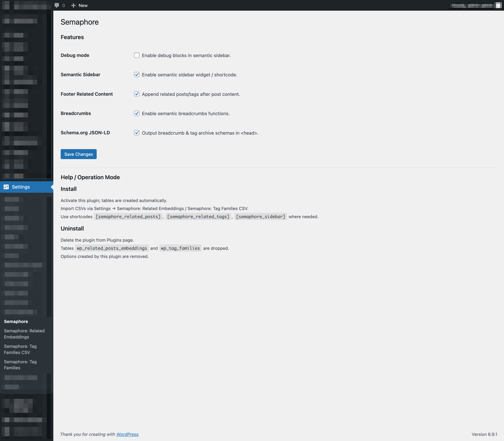
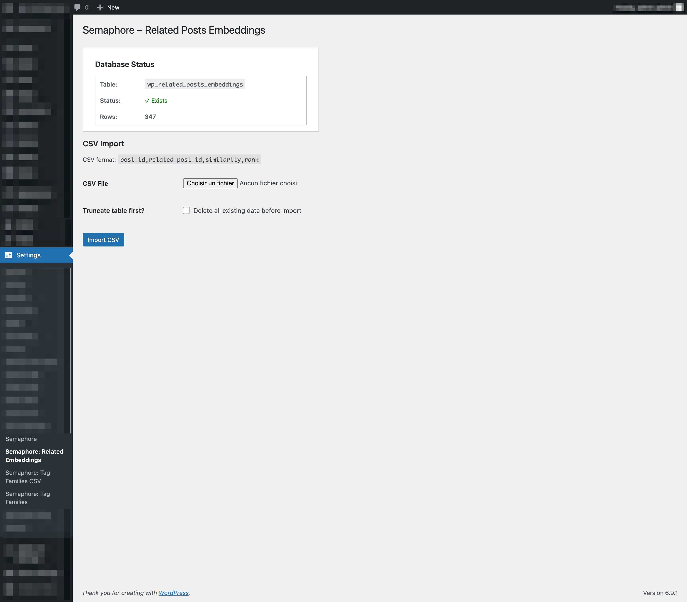
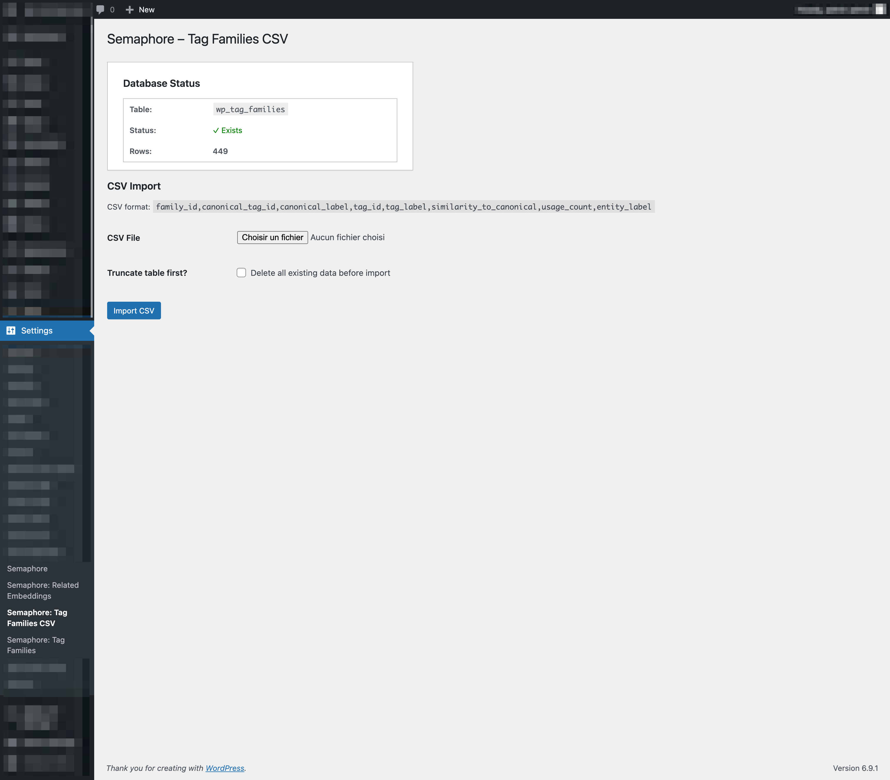
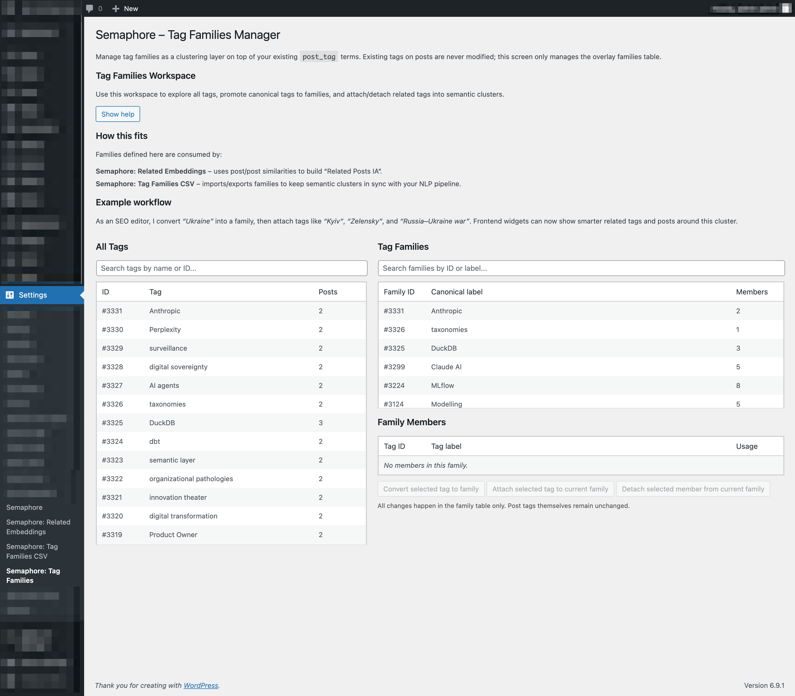
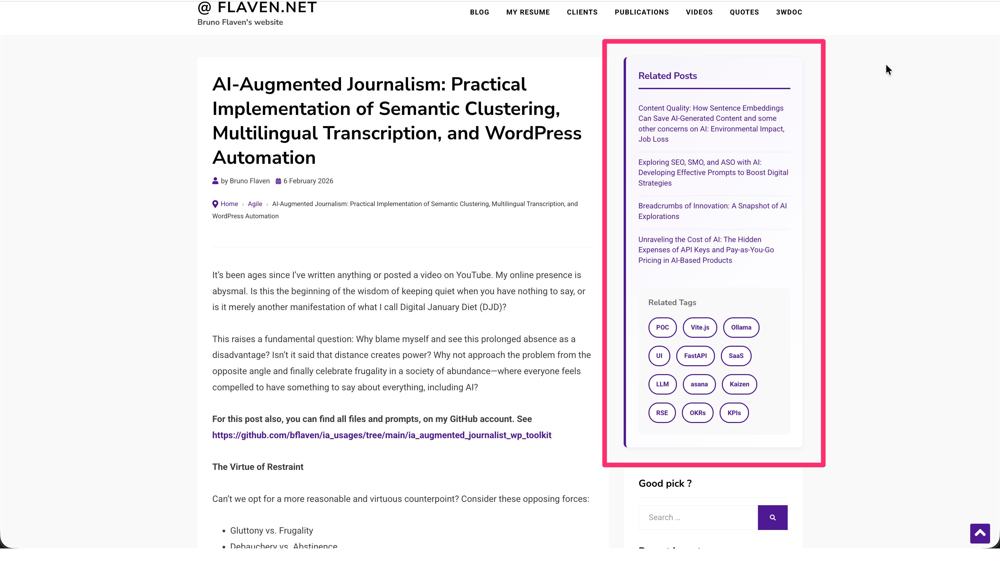
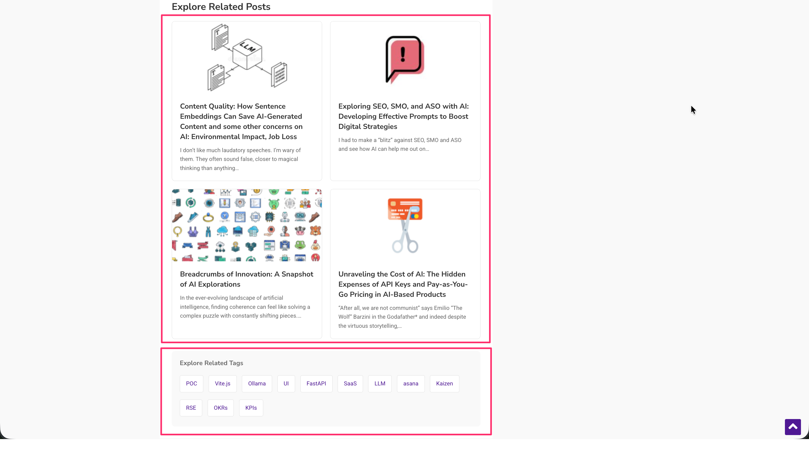

# Semaphore WordPress Plugin

**Version:** 1.2.2  
**Author:** Bruno Flaven & AI  
**Text Domain:** semaphore

## Description

Semaphore is a WordPress plugin that implements semantic clustering for content organization. It provides related posts functionality, tag families management, and automated schema markup generation based on semantic relationships between content.

```php
/**
 * Plugin Name: Semaphore
 * Description: Semantic clustering plugin (related posts, tag families, sidebar, breadcrumbs & schemas).
 * Version: 1.2.2
 * Author: Bruno Flaven & IA
 * Text Domain: semaphore
 */
```

## Core Features

- **Related Posts via Embeddings**: Calculates semantic similarity between posts using embedding models
- **Tag Families Management**: Groups related tags into semantic clusters with canonical labels
- **Sidebar Widget**: Displays related content based on semantic clustering
- **Subfooter Integration**: Shows related posts in theme subfooter
- **Breadcrumb Generation**: Creates semantic breadcrumbs with structured data
- **Schema Markup**: Automatically generates ld+json schema for improved SEO

## Admin Interface

### General Settings
Configure plugin-wide settings and behavior.



### Related Posts Embeddings
Manage the embedding model configuration and related posts calculation settings.



### Tag Families CSV Import
Import tag family relationships from CSV files with the following structure:
- `family_id`: Cluster identifier
- `canonical_tag_id`: WordPress tag ID representing the family
- `canonical_label`: Name of the parent tag
- `tag_id`: ID of family member
- `tag_label`: Name of member tag
- `similarity_to_canonical`: Semantic similarity score (0-1)
- `usage_count`: Number of posts using the tag
- `entity_label`: Named entity type (O, PERSON, ORG, GPE, CARDINAL, DATE, PRODUCT)



### Tag Families Manager
View and manage existing tag family relationships, canonical tags, and cluster assignments.



## Frontend Output

### Sidebar Display
The plugin outputs related posts in the sidebar based on semantic similarity calculations.



### Subfooter Display
Related posts can also be displayed in the theme subfooter area.



## Technical Implementation

- Integrates with WordPress REST API for content retrieval
- Uses embedding models for semantic similarity calculation
- Implements CSV-based tag family import system
- Generates Schema.org-compliant structured data (BreadcrumbList, CollectionPage)
- Maintains compatibility with existing WordPress tags for traditional SEO
- Provides overlay system that doesn't modify existing post_tag taxonomy

## Installation

1. Upload the plugin files to `/wp-content/plugins/semaphore/` directory
2. Activate the plugin through the 'Plugins' menu in WordPress
3. Configure settings in the Semaphore admin panel
4. Import tag families CSV (optional)
5. Configure embedding model settings for related posts

## Configuration Requirements

- WordPress 5.0 or higher
- PHP 7.4 or higher
- MySQL database access for tag family storage
- REST API enabled

## Use Cases

- Content websites requiring semantic content organization
- Multilingual blogs needing cross-language tag clustering
- Editorial workflows requiring AI-assisted tag suggestions
- Sites transitioning from flat taxonomies to hierarchical semantic structures
- Publishers implementing GEO (Generative Engine Optimization) strategies

## Development Credits

Developed by Bruno Flaven with AI assistance (Claude, Perplexity). Part of the AI-augmented journalism toolkit project focused on semantic content clustering and editorial workflow automation.

## License
At your own risk :)

## Support
Have the plugin's code analyzed by Chatgpt, Gemini, Claude, or Perplexity, and you'll have your explanations :)

