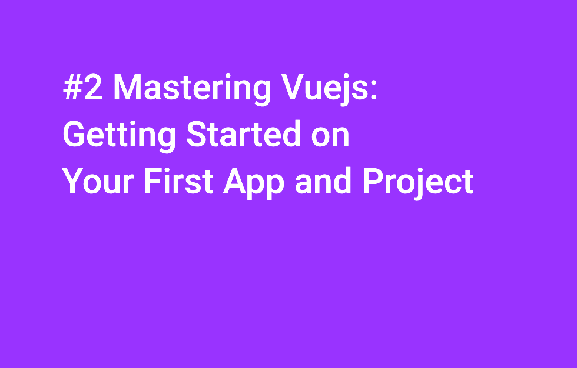
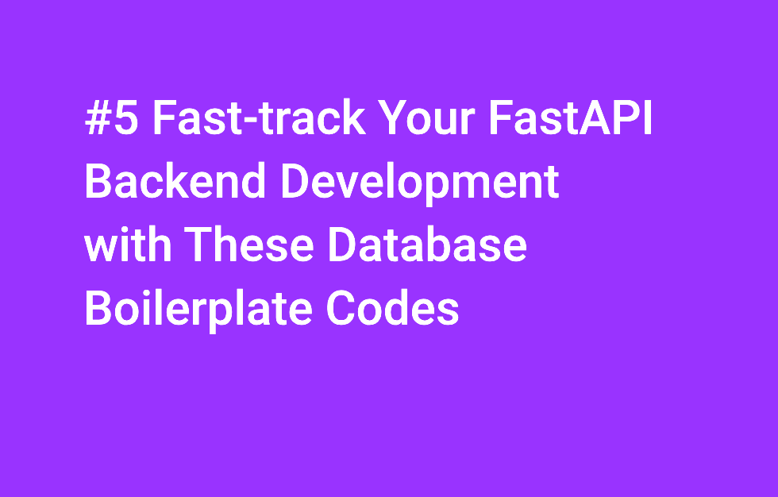

# ia_build_vue_js_on_fastapi

**Investigation  on how to replace a frontend made in Streamlit by one made with Vue.js**

## VIDEOS

You can find my WALKTHROUGH for these 6 videos walkthrough_ia_build_vue_js_on_fastapi.diff (Video #1, Video #2, Video #3, Video #4, Video #5, Video #6)

### DESCRIPTION
To accompany/explain certain posts, I started publishing videos on YouTube for fun. The latest videos to date were the report of a third year internship for which I was responsible. The latter are also paradoxically clearer than those posted today! What a joke ! But that is not the question.

The most striking thing is that I am increasingly experimenting with the integration of AI into this creation and publication process: generation of titles, generation of summaries, particularly for YouTube publication. In my opinion, strangely, this process somewhat softens the content itself by making it identical to hundreds of videos of this type.

Only the videos themselves ultimately retain this touching awkwardness made up of numerous slips of the tongue, of a Franglais that is sometimes approximate but ultimately human too human. Once again, I love these imperfections. This is undoubtedly better than definitively reifying the world and transforming myself into a robot. Indeed, the danger is to always favor form over substance out of aversion to risk. It is not AI that threatens us, it is the risk aversion of which it is the vector.

The 6 videos that echoed my last post "Building a Vue.js SPA (Single Page Application) Frontend with FastAPI Backend for AI Integration"

### LINKS
- Post : https://wp.me/p3Vuhl-3lp
- Code : https://shorturl.at/jkOOX

- Video 1. #scaffold Your First #vitejs #app: Comprehensive Beginner's Guide. https://youtu.be/RjP-KkmfscM

- Video 2. Master #vuejs: Build Your First #app and Project with Ease. https://youtu.be/lZFLytx-mr8

- Video 3. Display #api Data using #vuejs & #axios: Step-by-Step Tutorial. https://youtu.be/xZnym1tL3IY

- Video 4. Connect #fastapi #backend to #vuejs #frontend: Full Guide. https://youtu.be/RYKZfTAaC54

- Video 5. #fastapi #development Boost #productivity with boilerplate code with #database. https://youtu.be/Tjr5DYqxapE

- Video 6. #streamlit Mastery: View #whisper #transcripts & Prevent Page Reloads. https://youtu.be/xQT6bxVNbqY

### YOUTUBE VIDEOS
[Video #1 #scaffold Your First #vitejs #app: Comprehensive Beginner's Guide](https://www.youtube.com/watch?v=oBMK-QUYB7A)

[Video #2 Master #vuejs: Build Your First #app and Project with Ease](https://www.youtube.com/watch?v=oBMK-QUYB7A)

[Video #3 Display #api Data using #vuejs & #axios: Step-by-Step Tutorial
](https://www.youtube.com/watch?v=oBMK-QUYB7A)

[Video #4 Connect #fastapi #backend to #vuejs #frontend: Full Guide
](https://www.youtube.com/watch?v=oBMK-QUYB7A)

[Video #5 #fastapi #development Boost #productivity with boilerplate code with #database](https://www.youtube.com/watch?v=oBMK-QUYB7A)

[Video #6 #streamlit Mastery: View #whisper #transcripts & Prevent Page Reloads](https://www.youtube.com/watch?v=oBMK-QUYB7A)

