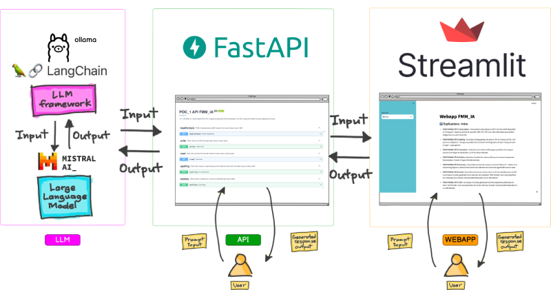

# ia_building_llm_api_web_apps_start_finish

# INTRO
**This time no code, you can find the prompts at https://github.com/bflaven/ia_usages_code_depot/tree/main/prompts/prompts_webapp_api_fmm_ia**


Following on from previous POCS, further integration of the “Webapp + API + LLM” system in order to experiment with the uses of AI.

**In this "Webapp + API + LLM" device, Mistral is used as LLM, LangChain and Ollama as framework to query the LLM, FastAPI as framework to create the API and Streamlit as framework to create the web application.**

**Once the device is launched, the API and the Webapp are available locally in the browser at these addresses:**
- API: http://127.0.0.1:8000/
- Webapp: http://localhost:8501/




*Simplified illustration of the possible AI ecosystem*


# PROJECT SCOPE

**In French, below, extracted from the orignal README of the project. I gave a descriptions for each functionalities written for the purpose of the project.**


## 1. Fonctionnalités implémentées


#### FONCTIONNALITÉ #1 Transcription
Transcription audio depuis un MP3. Fonctionnalité disponible en 70 langues + Export au format de sous-titre .SRT, .VTT, .TXT et en .CSV. 

Cette fonctionnalité utilise : 
- WHISPER https://github.com/openai/whisper
- FASTER-WHISPER https://github.com/SYSTRAN/faster-whisper
- FFMPEG https://ffmpeg.org/

*More on Whisper https://openai.com/research/whisper*


**Il existe aussi un endpoint pour la vidéo mais qui n'est pas branché à la Webapp. Le fonctionnement serait le même on upload juste des MP4 au lieu des MP3.**


#### FONCTIONNALITÉ #2 Spelling

Pour une correction orthographique de texte en FR. Ce n'est pas de l'IA. C'est juste une intégration d'un correcteur d’orthographe, de style et de grammaire. C'est celui de Open Office.

LanguageTool : https://languagetool.org/fr


**LANGUES DISPONIBLES**
- Français
- Anglais (US)
- Allemand (Allemagne)
- Allemand (Autriche)
- Allemand (Suisse)
- Anglais (Australien)
- Anglais (Britannique)
- Anglais (Canadien)
- Anglais (Néo-zélandais)
- Anglais (Sud-africain)
- Anglais (US)
- Arabe
- Asturien
- Biélorusse
- Breton
- Catalan
- Catalan (Valencien)
- Chinois
- Danois
- Espagnol
- Espéranto
- Français
- Galicien
- Grec
- Irlandais
- Italien
- Japonais
- Khmer
- Norvégien
- Néerlandais
- Persan
- Polonais
- Portugais (Angola)
- Portugais (Brésil)
- Portugais (Mozambique)
- Portugais (Portugal)
- Roumain
- Russe
- Slovaque
- Slovène
- Suédois
- Tagalog
- Tamoul
- Ukrainien

#### FONCTIONNALITÉ #3 Translation
Traduction d’un texte en 200 langues possibles d'une langue source à une langue de destination. Du FR au EN par exemple.

**La traduction s'appuie sur le model ou LLM **No Language Left Behind (NLLB)** de Meta.**

> No Language Left Behind (NLLB) is a first-of-its-kind, AI breakthrough project that open-sources models capable of delivering evaluated, high-quality translations directly between 200 languages—including low-resource languages like Asturian, Luganda, Urdu and more. It aims to give people the opportunity to access and share web content in their native language, and communicate with anyone, anywhere, regardless of their language preferences.


**En savoir plus**
- https://ai.meta.com/research/no-language-left-behind/
- https://huggingface.co/facebook/nllb-200-3.3B


#### FONCTIONNALITÉ #4 Entities
Extraction d'entités d’un texte en EN pour le moment uniquement faute de place. Il existe 18 types d'entités extraites.

**Librairie utilisée spaCy**
- spaCy · Industrial-strength Natural Language Processing in Python.  Voir https://spacy.io/

spaCy disponible en : Catalan, Chinese, Croatian, Danish, Dutch, English, Finnish, French, German, Greek, Italian, Japanese, Korean, Lithuanian, Macedonian, Multi-language, Norwegian Bokmål, Polish, Portuguese, Romanian, Russian, Slovenian, Spanish, Swedish, Ukrainian.


**Qu'est-ce qu'une entité ?**

Il existe 18 types d'entités: 

1. PERSON: Short name or full name of a person from any geographic regions. 
2. DATE: Any format of dates. Dates can also be in natural language.
3. LOC: Name of any geographic location, like cities, countries, continents, districts etc.
4. ORG: Any named organization, institution, company, government, or other group of people with a collective purpose or function.
5. CARDINAL: Numerals that do not fall under another type, such as counting numbers (one, two, three), fractions, and ordinals.
6. GPE: Geopolitical entities, including countries, cities, states.
7. MONEY: Monetary values, including currency symbols, monetary amounts, and terms related to money.
8. PRODUCT: Objects, artifacts, and substances produced or refined for sale.
9. TIME: Time expressions, including specific times of day, durations, and time intervals.
10. PERCENT: Percentage expressions, including numerical values followed by the percent symbol (%).
11. WORK_OF_ART: Titles of artistic works, including books, songs, paintings, and other creative expressions.
12. QUANTITY: Measurements or counts of things that can be expressed in numbers.
13. NORP: Nationalities or religious or political groups.
14. EVENT: Named occurrences or happenings, including natural and human-made incidents.
15. ORDINAL: Words or expressions that denote a rank, order, or sequence.
16. FAC: Named facilities, installations, or structures, such as buildings, airports, highways, bridges, and stadiums.
17. LAW: Named documents made by people or organizations, such as laws, regulations, statutes, and legal codes.
18. LANGUAGE: Any named language entity, including individual languages or language families.

#### FONCTIONNALITÉ #5 Summary
Reconditionnement du contenu au format "Résumé" : création d’un résumé long depuis un texte en FR et en EN avec sélection de 5 mots-clés significatifs issus du texte.

+ **La fonction de résumé utilise BART-LARGE-CNN**
https://huggingface.co/facebook/bart-large-cnn

* **La Webapp est branché sur ce point de terminaison (endpoint) de l'API `/summary/bart`**. Ce point de terminaison génère,  à l'aide du modèle BART, un résumé du texte saisi.

* Il existe deux autres points de terminaison (endpoint) pour accéder à d'autres fonctions possibles de résumé `/summary/bart_conditional_generation` et `/summary/ktrain_transformer_summarizer` mais qui ne sont pas branchés sur la Webapp.
                
#### FONCTIONNALITÉ #6 Social
Reconditionnement du contenu dans un format spécifique pour les Réseaux Sociaux : Sur la base d'un texte, génération d'un tweet de 140 caractères "SMO friendly" avec une proposition de 5 hashtags issus du texte. Fonctionnalité disponible via un LMM (Mistral)

Cette fonctionnalité utilise véritablement un LLM via des prompts. Le LLM utilisée est Mistral. On pourrait utiliser le LMM ChatGPT, mais Mistral est une alternative française intéressante qui assure la confidentialité et la quasi-gratuité.

**Mistral 7B in short**

Mistral 7B is a 7.3B parameter model that:
- Outperforms Llama 2 13B on all benchmarks
- Outperforms Llama 1 34B on many benchmarks
- Approaches CodeLlama 7B performance on code, while remaining good at English tasks
- Uses Grouped-query attention (GQA) for faster inference
- Uses Sliding Window Attention (SWA) to handle longer sequences at smaller cost

**Liens**
- https://ollama.com/library/mistral
- https://mistral.ai/news/announcing-mistral-7b/

#### FONCTIONNALITÉ #7 SEO
Sur la base d'un texte, génération de trois propositions éditoriales de titres "SEO friendly" avec une proposition de 5 mots-clés issus du texte. Fonctionnalité disponible via un LMM (Mistral)

**Pour Mistral, spécifications identiques à la FONCTIONNALITÉ #6**

## 2. HOW-TO: Exécuter l'application

En LOCAL, pour faire fonctionner localement avec un environnement de dev Python. Requirement: Anaconda ou Poetry ou Venv, installer les modules nécessaires cf. `requirements.txt`. Il faut  lancer trois terminaux avec le même environnement de dev e.g `fmm_fastapi_poc`.

1. Terminal_1 : Activer l'environnement et lancer l'API avec la commande `uvicorn api:app --reload`

2. Terminal_2 : Activer l'environnement et lancer la WEBAPP avec la commande `streamlit run ux.py`

3. Terminal_3 : Avoir ollama installé et et lancer le LLM avec la commande `ollama serve`


```bash
[env]
# Conda Environment
conda create --name fmm_fastapi_poc python=3.9.13
conda info --envs
source activate fmm_fastapi_poc
conda deactivate

# if needed to remove
conda env remove -n [NAME_OF_THE_CONDA_ENVIRONMENT]


# update conda 
conda update -n base -c defaults conda

# to export requirements
pip freeze > requirements.txt

# to install
pip install -r requirements.txt


[install]
# for ML
python -m pip install transformers 
python -m pip install pyarrow
python -m pip install pandas
python -m pip install numpy
python -m pip install tensorflow
python -m pip install sentencepiece
python -m pip install torchvision 

# all in one plus spellchecker
python -m pip install transformers pyarrow pandas numpy tensorflow sentencepiece language-tool-python


# for API
python -m pip install fastapi uvicorn 
python -m pip install fastapi transformers

# for UX
python -m pip install streamlit requests

# for search
pip install ktrain 
pip install tensorflow 

# for audio
pip install whisper
pip install faster_whisper

# [path]
cd [path-to-directory]/006_webapp_api_fmm_ia

# LAUNCH THE API
uvicorn api:app --reload

# LAUNCH THE WEBAPP
streamlit run ux.py

# LAUNCH THE LLM
ollama serve


# local
http://localhost:8000
http://127.0.0.1:8000

# docker
http://localhost
http://0.0.0.0:80
```


## 3. Documentation API
La documentation swagger est disponible sur swagger docs lorsque vous exécutez l'application API

```bash
# LAUNCH THE API
uvicorn api:app --reload

# check local
http://localhost:8000
http://127.0.0.1:8000

```


## 4. Exemples de prompt

Quelques exemples de prompts qui interrogent le LLM **Mistral 7B** via **Ollama**. Ces prompts sont dans les fichiers `service/generic_prompts_service.py` et `service/social_prompts_service.py`.

- **Dans `service/generic_prompts_service.py` :** les prompts pour le resumé d'un texte + 5 mots-clés issus du texte.

- **Dans `service/social_prompts_service.py` :** les prompts pour les propositions SEO et SMO sur la base d'un texte. 

	+ **SEO :** c'est 3 propositions sur la base du texte : 1 titre + 5 mots-clés;
	+ **SMO :** c'est 3 propositions sur la base du texte : 1 message de 280 caractères + 3 hashtags.


**Dans `service/generic_prompts_service.py`**
```python
english_summarize_prompt = """
    [INST] You are a helpful summarizer assistant. Your task is to generate a valid summary object based on the given information : content: {content}.
    \n
    You should also identify 5 key words or phrases that best represent the content.
    \n
    For the proposal, print only the result in a Python dictionary object with the summary as a string and the 5 keywords as a list. Include the all result into a Python list object like define below.
    \n
    Output Format:\n
    [
    {{"summary": "The summary of the content", "keywords": ["word1", "word2", "word3", "word4", "word5"]}}
    ]
    \n
    \n[/INST]
"""


french_summarize_prompt = """
    [INST] You are a helpful summarizer assistant in French. Your task is to generate a valid summary object in French based on the given information in French. content: {content}.
    \n
    For the proposal, print only the result in French a Python dictionary object with the summary as a string and 5 keywords related to the content as a list. Include the all result into a Python list object like defined below.
    \n
    Output Format:\n
    [
    {{"summary": "The French summary of the content", "keywords": ["keyword1", "keyword2", "keyword3", "keyword4", "keyword5"]}}
    ]
    \n
    [/INST]
"""


french_to_english_translate_prompt = """
You are a helpful and accurate translator. You have been provided with a source text in French, and your task is to translate this text into English. Please ensure that the translation preserves the original meaning and context as closely as possible.

French Source Text: {content}

English Translation:
"""


english_to_french_translate_prompt = """
You are a helpful and accurate translator. You have been provided with a source text in English, and your task is to translate this text into French. Please ensure that the translation preserves the original meaning and context as closely as possible.

English Source Text: {content}

French Translation:
"""


```

**Dans `service/social_prompts_service.py`**

```python
english_seo_prompt = """
    You are a smart and intelligent journalist. Craft three compelling and unique titles for an online post about the topic given in the content. Ensure to incorporate SEO best practices by including the most common and relevant keywords from the content in each title.
    \n
    For each proposal, print only the result in a Python dictionary object with 'title' as a string and 'keywords' as a list. Include all three results into a Python list object like defined below.
    \n
    Output Format:\n
    [
    {{"title": "The value of the title", "keywords": ["keyword1", "keyword2", "keyword3"]}},
    {{"title": "The value of the title", "keywords": ["keyword1", "keyword2", "keyword4"]}},
    {{"title": "The value of the title", "keywords": ["keyword1", "keyword2", "keyword5"]}}
    ]
    \n
    Content: {content}
"""

french_seo_prompt = """
    You are a French smart and intelligent journalist. Craft three compelling titles in French for an online post about the topic given in the content in French. Ensure to incorporate SEO best practices by including the most common keywords from the content. For each proposal, print only the result in French as a Python dictionary object with 'title' as a string and 'keywords' as a list. Include all results into a Python list object as defined below.
    \n
    Output Format:\n
    [
    {{"title": "The value of the title", "keywords": ["keyword1", "keyword2", "keyword3"]}},
    {{"title": "The value of the title", "keywords": ["keyword1", "keyword2", "keyword3"]}},
    {{"title": "The value of the title", "keywords": ["keyword1", "keyword2", "keyword3"]}}
    ]
    \n
    Content: {content}
"""


english_smo_prompt = """
    You are a smart and intelligent community manager. Craft three compelling messages of 280 characters each for an online post about the topic given in the content. Ensure to incorporate Social Media Optimization (SMO) best practices by including the most common keywords from the content. For each proposal, print only the result in a Python dictionary object with 'message' as a string and 'hashtags' as a list of hashtags. In the list of hashtags, for each hashtag, do not forget to add the sign "#" in front of it e.g. "hashtags": ["#hashtag1", "#hashtag2", "#hashtag3"]. Include all results into a Python list object as defined below.
    \n
    Output Format:\n
    [
    {{"message": "The value of the message", "hashtags": ["#hashtag1", "#hashtag2", "#hashtag3"]}},
    {{"message": "The value of the message", "hashtags": ["#hashtag1", "#hashtag2", "#hashtag3"]}},
    {{"message": "The value of the message", "hashtags": ["#hashtag1", "#hashtag2", "#hashtag3"]}}
    ]
    \n
    Content: {content}
"""

french_smo_prompt = """
    En français, vous êtes un gestionnaire de communauté intelligent et futé. Rédigez en français trois messages percutants de 280 caractères chacun pour une publication en ligne sur le sujet donné dans le contenu, en veillant à incorporer les meilleures pratiques d'optimisation des médias sociaux (SMO) avec les mots-clés les plus courants du contenu. Pour chaque proposition en français, n'imprimez que le résultat dans un objet Python dictionary avec 'message' sous forme de chaîne et 'hashtags' sous forme de liste de hashtags. Dans la liste des hashtags, pour chaque hashtag, n'oubliez pas d'ajouter le signe "#" devant celui-ci, par exemple "hashtags": ["#hashtag1", "#hashtag2", "#hashtag3"]. Incluez tous les résultats dans un objet Python list comme défini ci-dessous.
    \n
    Format de Sortie:\n
    [
    {{"message": "La valeur du message", "hashtags": ["#hashtag1", "#hashtag2", "#hashtag3"]}},
    {{"message": "La valeur du message", "hashtags": ["#hashtag1", "#hashtag2", "#hashtag3"]}},
    {{"message": "La valeur du message", "hashtags": ["#hashtag1", "#hashtag2", "#hashtag3"]}}
    ]
    \n
    Contenu: {content}
"""

```

## 5. Arborescence du répertoire

- `service` : Le répertoire `service` contient la logique métier ou les services utilisés par l'application. Chaque service correspond à une ressource ou un module spécifique et comprend des fichiers permettant d'implémenter la logique métier liée à cette ressource.

- `config_files`:  Le répertoire `config_files` contient divers fichiers de configuration requis pour les paramètres et les variables d'environnement de l'application. Il comprend des fichiers d'initialisation, des constantes, des paramètres et des fonctions utilitaires pour injecter ces paramètres de configuration.


- `data` : Le répertoire `data` contient contient des éléments de contenu pour la démo du fonctionnement de l’ensemble. Il comprend des fichiers pour la manipulation des données.


- `ux.py` : Le fichier `ux.py` contient la logique des écrans de la WEBAPP qui est connectée à l'API. La WEBAPP est conçue à l’aide de Streamlit. Il serait possible de connecter d'autres WEBAPP en Vite.js par ex ou des WEBAPP métier.


- `api.py` : Le fichier `api.py` contient la logique de l'API avec un ensemble de endpoints consommés par la WEBAPP. L'API est conçue à l’aide de FastAPI et possède une documentation Swagger.


```bash
README.md
__init__.py
api.py
config_files
data
requirements.txt
service
ux.py

```

**Le détail du répertoire service**
```bash
__init__.py
generic_ollama_service.py
generic_prompts_service.py
social_ollama_service.py
social_prompts_service.py
spelling_spellchecker_service.py
translate_lang_list_service.py
translate_translator_service.py
```


**Le détail complet de l'arborescence**
```bash
.
├── README.md
├── __init__.py
├── api.py
├── captures
│   ├── console_1_fastapi.png
│   ├── console_2_streamlit.png
│   ├── console_3_ollama.png
│   ├── webapp_api_llm_1_fastapi.png
│   ├── webapp_api_llm_2_streamlit.png
│   └── webapp_api_llm_3_streamlit.png
├── config_files
│   └── config.py
├── data
│   ├── __init__.py
│   ├── show_player_files
│   │   ├── audio_fr_whisper_express_player_chronique_de_ja_bell.html
│   │   ├── audio_fr_whisper_express_player_grand_invite_international.html
│   │   ├── audio_fr_whisper_express_player_mamane.html
│   │   ├── video_01_fr_whisper_express_player_f24.html
│   │   ├── video_02_fr_whisper_express_player_f24.html
│   │   └── video_03_vroux_fr_whisper_express_player.html
│   ├── source.db
│   ├── videos
│   │   ├── 01_video_FR_20240215_110050_110458_CS_5000.m4v
│   │   ├── 01_video_FR_20240215_110050_110458_CS_5000_whisper.json
│   │   ├── 01_video_FR_20240215_110050_110458_CS_5000_whisper_express_EN.json
│   │   ├── 01_video_FR_20240215_110050_110458_CS_5000_whisper_express_EN.srt
│   │   ├── 01_video_FR_20240215_110050_110458_CS_5000_whisper_express_FR.json
│   │   ├── 01_video_FR_20240215_110050_110458_CS_5000_whisper_express_FR.srt
│   │   ├── 02_FR_20240215_120308_120700_CS_5000.m4v
│   │   ├── 02_FR_20240215_120308_120700_CS_5000_whisper.json
│   │   ├── 02_FR_20240215_120308_120700_CS_5000_whisper_express_EN.json
│   │   ├── 02_FR_20240215_120308_120700_CS_5000_whisper_express_EN.srt
│   │   ├── 02_FR_20240215_120308_120700_CS_5000_whisper_express_FR.json
│   │   ├── 02_FR_20240215_120308_120700_CS_5000_whisper_express_FR.srt
│   │   ├── black_history_month_light.mp4
│   │   ├── black_history_month_light_FR.json
│   │   └── black_history_month_light_FR.txt
│   └── vroux_files
│       ├── CHR_MAMANE_08_02.mp3
│       ├── CHR_MAMANE_08_02.rtf
│       ├── CHR_MAMANE_08_02.txt
│       ├── Chronique_de_JA_Bell_du_jeudi_8_fevrier.mp3
│       ├── Chronique_de_JA_Bell_du_jeudi_8_fevrier.rtf
│       ├── Chronique_de_JA_Bell_du_jeudi_8_fevrier.txt
│       ├── GRAND_INVITE_INTERNATIONAL_06_02_Rafael_Grossi.mp3
│       ├── GRAND_INVITE_INTERNATIONAL_06_02_Rafael_Grossi.rtf
│       ├── GRAND_INVITE_INTERNATIONAL_06_02_Rafael_Grossi.txt
│       └── comparaison_transcript
│           ├── CHR_MAMANE_08_02_transcription_limecraft.txt
│           ├── CHR_MAMANE_08_02_transcription_whisper.json
│           ├── CHR_MAMANE_08_02_transcription_whisper_express_srt.json
│           ├── CHR_MAMANE_08_02_transcription_whisper_express_srt.srt
│           ├── CHR_MAMANE_08_02_transcription_whisper_express_srt_exported.json
│           ├── Chronique_de_JA_Bell_du_jeudi_8_fevrier_transcription_limecraft.txt
│           ├── Chronique_de_JA_Bell_du_jeudi_8_fevrier_transcription_whisper.json
│           ├── Chronique_de_JA_Bell_du_jeudi_8_fevrier_transcription_whisper_express_srt.json
│           ├── Chronique_de_JA_Bell_du_jeudi_8_fevrier_transcription_whisper_express_srt.srt
│           ├── GRAND_INVITE_INTERNATIONAL_06_02_Rafael_Grossi_transcription_limecraft.txt
│           ├── GRAND_INVITE_INTERNATIONAL_06_02_Rafael_Grossi_transcription_whisper.json
│           ├── GRAND_INVITE_INTERNATIONAL_06_02_Rafael_Grossi_transcription_whisper_express_srt.json
│           ├── GRAND_INVITE_INTERNATIONAL_06_02_Rafael_Grossi_transcription_whisper_express_srt.srt
│           └── compare_sample
│               ├── CHR_MAMANE_08_02_transcription_limecraft_1.txt
│               ├── CHR_MAMANE_08_02_transcription_whisper_2.txt
│               ├── Chronique_de_JA_Bell_du_jeudi_8_fevrier_transcription_limecraft_1.txt
│               ├── Chronique_de_JA_Bell_du_jeudi_8_fevrier_transcription_whisper_2.txt
│               ├── GRAND_INVITE_INTERNATIONAL_06_02_Rafael_Grossi_transcription_limecraft_1.txt
│               └── GRAND_INVITE_INTERNATIONAL_06_02_Rafael_Grossi_transcription_whisper_2.txt
├── requirements.txt
├── service
│   ├── __init__.py
│   ├── generic_prompts_service.py
│   ├── social_ollama_service.py
│   ├── social_prompts_service.py
│   ├── spelling_spellchecker_service.py
│   ├── summary_ollama_service.py
│   ├── translate_lang_list_service.py
│   └── translate_translator_service.py
├── ux.py
├── walkthrough_ia_using_other_llm.diff
├── workflow_webapp_api_llm_4.png
└── workflow_webapp_api_llm_4_small.png

```
