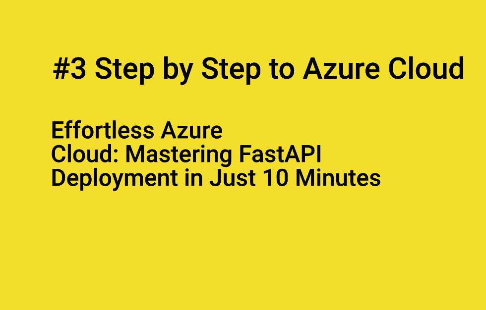

# ia_deploy_api_ml_architecture

This last post is again a journal to me of an how-to. This time, the post is dedicated on how to deploy in the Cloud a Machine Learning’s features API, built with FastAPI. For the cloud, I have chosen Azure as I will probably work with it. Indeed, the deployment in the Cloud is the last step to close my Machine Learning’s API creation process investigation. Previously, I explored roughly all the required steps from ML (Machine Learning) customization to development with FastAPI, through the discovery of specific packages like Whisper, Spacy for instance.

**See at [Step by step Introducing to Azure Cloud Deployment: Deploying a FastAPI ML Feature API](https://flaven.fr/2023/10/step-by-step-introducing-to-azure-cloud-deployment-deploying-a-fastapi-ml-feature-api/)**

## FILES

**Here is the code produced through the different experiments that I made to understand deploy on Azure for a webapp.**

- `advanced_docker_compose_fastapi`: several example using docker-compose and Makefile.
- `api_fastapi_routes`: routing issue with some solution provided with the help of ChatGPT
- `fastapi-simple-app`: simple app ready to deploy to the Azure Cloud.
- `fastapi_cheatsheet`: cheat sheet for FastAPI for documentation especially.
- `fastapi_tiangolo_advanced_settings`: advanced setting examples.
- `mamamia-fastapi-azure`: application, written with the help of ChatGPT, made with FastAPI, ready to deploy to the Azure Cloud.

## Videos

You can find my WALKTHROUGHS for these 5 videos walkthrough_ia_deploy_api_ml_architecture.diff (Video #1, Video #2, Video #3, Video #4, Video #5)

### Video #1

A quick and basic API building FastAPI to test it locally with anaconda.

[#seamless #fastapi #api #development: From Local Setup with #anaconda to #azure #deployment](https://www.youtube.com/watch?v=TMSIobG9nQo)

### Video #2

Optimizing Azure Deployment: Containerize Your FastAPI Application with Docker for Effortless Integration into the Azure Ecosystem

[Simplified #azure #deployment: #containerizing #fastapi #app with #docker & Integration with #azure](https://www.youtube.com/watch?v=6Z7UyMgehjk)

### Video #3

A comprehensive step-by-step tutorial takes you on a journey through the entire process of deploying a FastAPI application on the Azure Cloud. From creating the Azure resource group to publishing your app, you'll learn how to do it all using Azure Command Line Interface (AZ CLI). Get ready to streamline your FastAPI deployment on Azure in no time!"

[#mastering #azure #cloud #deployment: Deploy a Simple FastAPI Application in 10 Minutes in Azure!](https://www.youtube.com/watch?v=7WdUmqp1eDY)

### Video #4

In this video, we'll guide you through the essential steps of preparing your application for deployment on Azure. We'll also show you how to save precious time by using a Makefile to automate and simplify the process of running Docker commands. Say goodbye to tedious typing and hello to efficient Azure deployment!

[#streamline #azure #deployment: Simplify #docker Operations with a #makefile for Your #application](https://www.youtube.com/watch?v=9DDuserTvCk)

### Video #5

Explore the advanced world of application development as we guide you through the creation of a dynamic web application using Streamlit for the frontend and FastAPI for the backend. But that's not all – we'll also show you how to streamline your workflow with a Makefile, eliminating the need to type out lengthy Docker commands.

[#development: #streamlit, #fastapi, simplify the deployment of #frontend & #backend with a #makefile](https://www.youtube.com/watch?v=VDw1wutnqN8)

