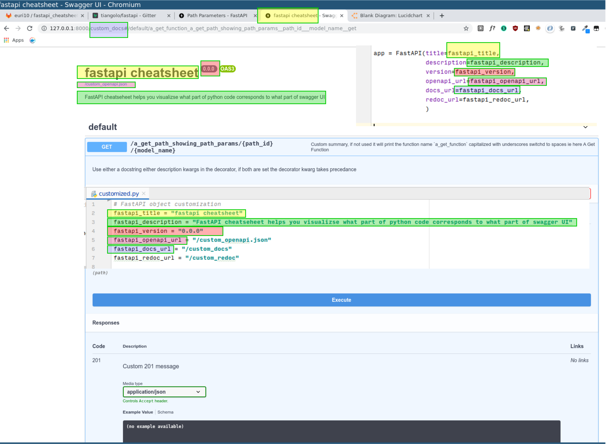
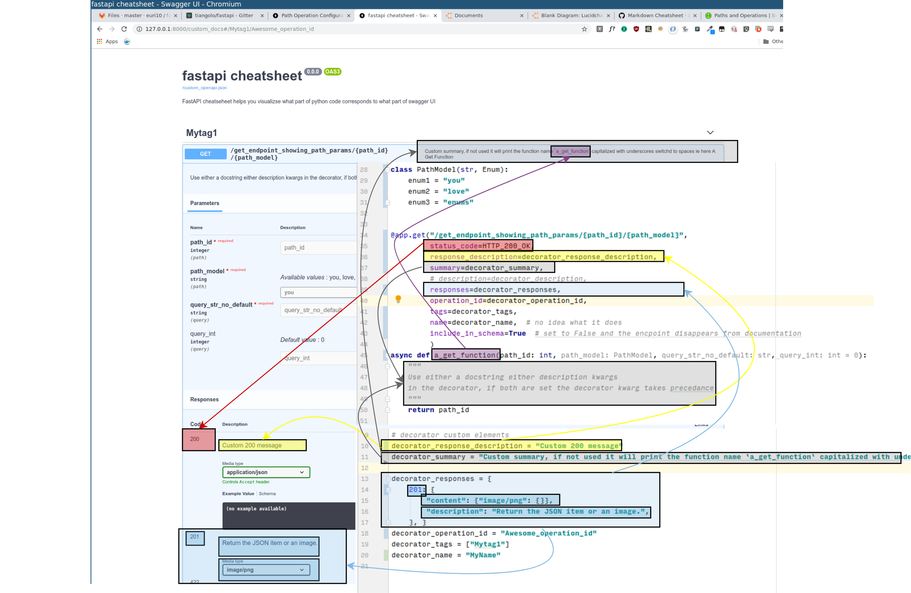
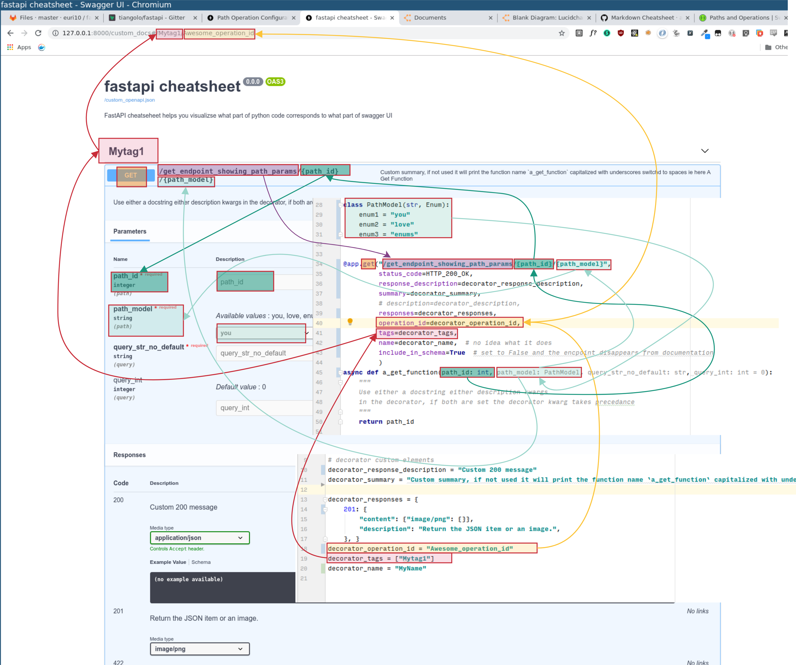
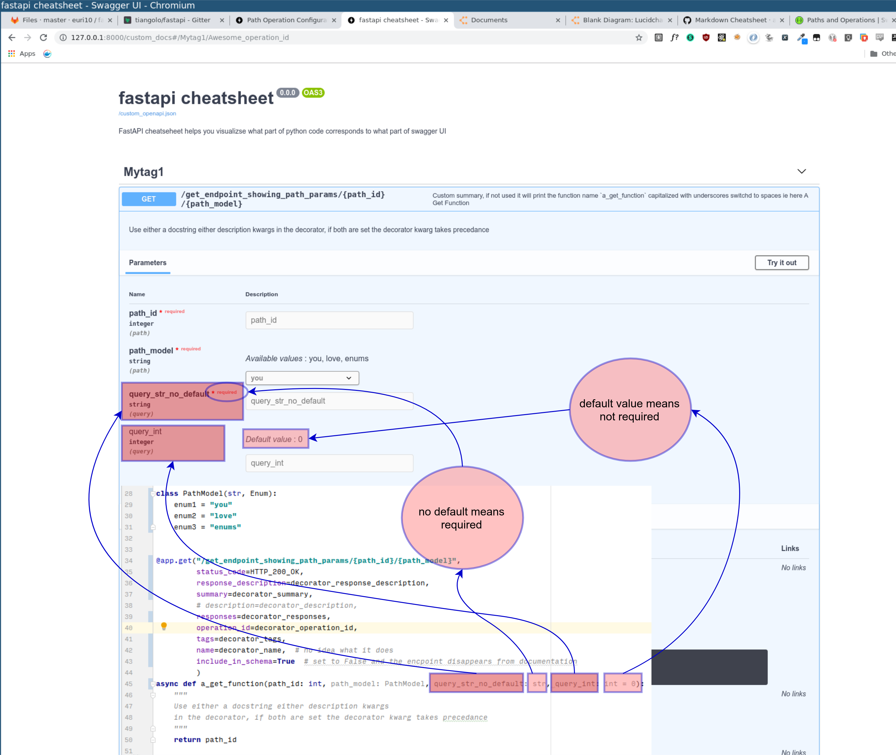

# fastapi_cheatsheet

**A great source of information on how to document FastAPI, taking the best advantage of Swagger integrated into FastAPI. Very useful.**

**Documentation is KEY.... because it supports adoption and uses**

# ORIGINAL_README

# fastapi_cheatsheet

## why ?

Classic repository question:

> Q: How do you add a description ?

> A: A description to what ?

> Q: To the response

> A: Which one, you can add multiple responses to an endpoint...

> Q: What ? You can do that ? You're insane dude my consumers won't cope with multiple answers, status codes, I'm glad it exists but well, let's say I just want to customize the description for the default status code of that endpoint.

> A: Ok there is a `responses` kwargs in the decorator, that's for the multiple answers.
Now for the default status code there is the `response_description` kwarg

Or you could do:

> Check the yellow box with black outline on the [2nd image](https://gitlab.com/euri10/fastapi_cheatsheet/raw/master/fastapi_cheatsheet_general_endpoint.png), that's how you can do that.

## Tools used

Generated using draw.io, links for each graph is in the description below.

Saved as png with transparent background, 300dpi.

I'm no design wizard, every comment, PR is more than welcome.

## FastAPI object customized, title, description

You can comment [here](https://drive.google.com/file/d/1wh2uK3YYtC50wncQuLnHNNdVeRFVaXn6/view?usp=sharing)

## FastAPI general swagger endpoint description

You can comment [here](https://drive.google.com/file/d/1xCYkcK8YI2zXwzi97XVeegsoVFa0feQq/view?usp=sharing), boxes with black outline shows some general endpoints cusomization possible:

## FastAPI path operations

You can comment [here](https://drive.google.com/file/d/1DkJuYFjk4kPSO3Y8EfXCIrhGJOwE-CsZ/view?usp=sharing) boxes with red outline shows how path operations parameters are represented in swagger given the code:

## FastAPI query operations

You can comment [here](https://drive.google.com/file/d/1sylWpYpi91ub0D7mEsXHzy7kol4S0VYL/view?usp=sharing) boxes with blue outline shows how query operations parameters are represented in swagger given the code:

## notes to self while doing this on potentially simplifying usage
1. in FastAPI object, pydantic type for `openapi_url`, `docs_url`, `redoc_url` could be stricter and impose having a forward slash imposed.
2. in route decorator, the order of kwargs makes no sense, group them in sensible buckets, ie for instance `status_code` should be with `response_description`
3. in route decorator the kwarg `summary` is not explicit enough imho
4. explain precedance of various elements better in the docs
5. if you set `response_description` there is no way to set a response example, or is there ?

