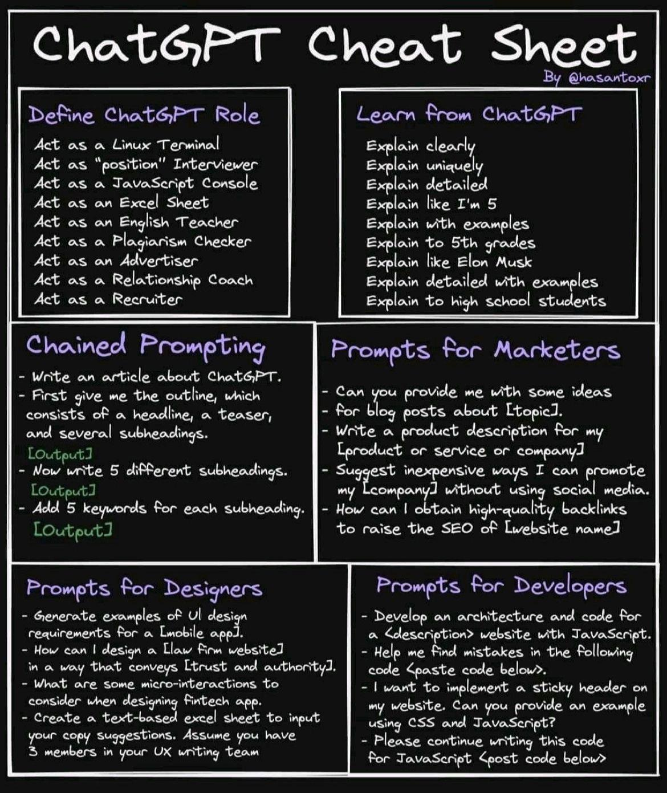

# ia_prompt_academy

I wished I built a collection of resources to understand and learn the art of the prompt. It ends up finally with a randomly bulletproof prompts dictated by usage and used directly on the models (ChatGPT, Mistral, Phi-3, Llama, Codellama.... etc.)

> In each directory from now on I add a `prompts` directory which contains all the prompts that accompany me in writing posts.

As an example, you can check "ia_prompt_seo" on the github repo at https://github.com/bflaven/ia_usages/tree/main/ia_prompt_seo

**My model was this kind of stuff a cheatsheet for chatgpt**

