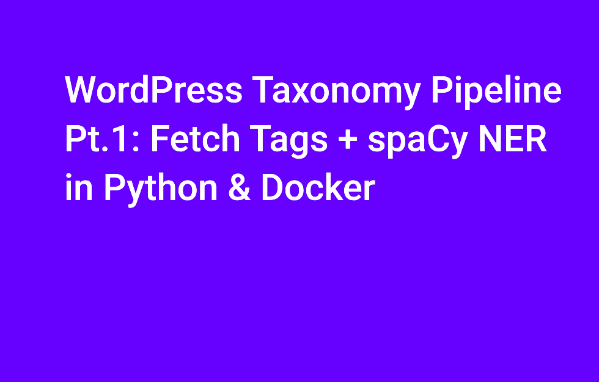
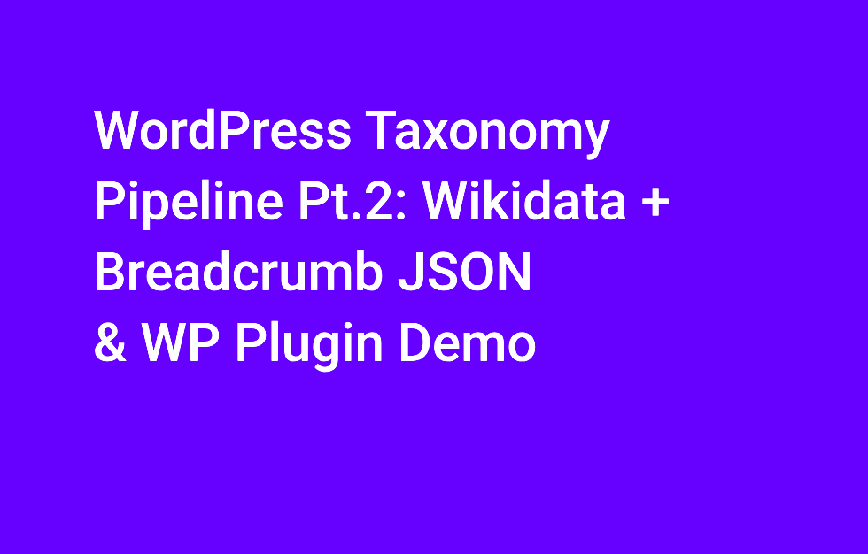
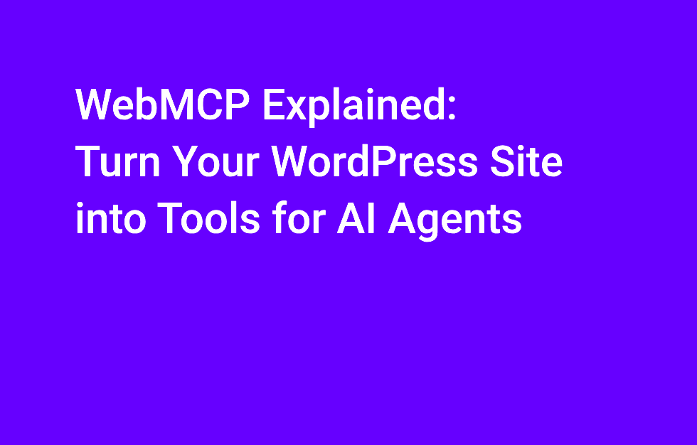

# ia_seo_ia_semantic_breadcrumb_webmcp

WebMCP, the End of Clicks, and the Semantic Upgrade Your WordPress Site Actually Needs [https://wp.me/p3Vuhl-3rb](https://wp.me/p3Vuhl-3rb)

## Breadcrumb Migration Pipeline + wp plugin
- `_prompt`
- `breadcrumb-migration-pipeline`: 
- `breadcrumb-migration-pipeline-sql`
- `breadcrumb-migration-pipeline-wp_docker`
- `breadcrumb-migration-pipeline-wp_plugins_breadcrumb`
- `migrate-categories-by-claude`
- `migration-python-wp-handling-migration-redirects`
- `README.md`: this readme

## WebMCP
- `WebMCP_CLAUDE_EN.md`: WebMCP — Strategic Analysis for WordPress Tech Blog aka flaven.fr
- `awesome-webmcp-bridge`: WebMCP for WordPress. Exposes WordPress content as structured tools for AI agents via the [WebMCP proposed standard](https://webmcp.dev)

# Use Case — Abstract Description (IA made)

## Directory Descriptions

### `_prompt`
Collection of iterative prompts used to drive Claude (and other AI tools) throughout the project. Covers early exploration of the breadcrumb pipeline concept, requirements gathering, CLAUDE.md scaffolding, and the editorial category consolidation problem. Serves as the conversation log and specification source for everything built in the other directories.

### `breadcrumb-migration-pipeline`
Core Python pipeline (4 sequential steps) that automates semantic enrichment of WordPress taxonomy terms:
1. **Step 1** — Fetch all tags and categories from a live WordPress MySQL database.
2. **Step 2** — Run spaCy Named Entity Recognition (NER) to detect entity types (person, org, location, product…).
3. **Step 3** — Query Wikidata to attach canonical IDs, labels, and descriptions to each term.
4. **Step 4** — Generate structured breadcrumb proposals and write them to custom MySQL tables.

Orchestrated by `run_pipeline.py` (Python) or `run_pipeline.sh` (Bash). Supports dry-run mode, step-level resumption, and per-taxonomy filtering.

### `breadcrumb-migration-pipeline-sql`
SQL schema for the two custom MySQL tables (`wp_breadcrumb_terms`, `wp_breadcrumb_proposals`) that back the pipeline. Designed to sit alongside WordPress core tables without modifying them. Stores the original term snapshot, the spaCy/Wikidata-enriched proposals, validation state, and the final JSON breadcrumb array per term.

### `breadcrumb-migration-pipeline-wp_docker`
Docker Compose environment that spins up WordPress + MySQL + phpMyAdmin locally (ports 8080/8081). Used to test all pipeline steps and WordPress plugins in isolation before touching the production site. Enables importing production DB dumps, validating schema markup, and debugging plugin output in a safe sandbox.

### `breadcrumb-migration-pipeline-wp_plugins_breadcrumb`
Suite of four WordPress plugins built to support the migration workflow:
- **breadcrumb-migration** — Validates spaCy/Wikidata pipeline proposals and publishes enriched taxonomy terms back into WordPress.
- **breadcrumb-migration-category-migration** — Two-tab admin tool: drag-and-drop post re-categorisation (multi-select, non-destructive) + `.htaccess` 301-redirect generator for renamed categories.
- **breadcrumb-migration-primary-category** — Lets editors define and bulk-manage a primary category per post without altering existing category assignments.
- **breadcrumb-migration-taxonomy-exporter** — Exports `category` or `post_tag` taxonomies to JSON/CSV for Step 1 of the pipeline (inventory phase).

### `migrate-categories-by-claude`
Editorial mapping artifact: the old 103-item French category taxonomy collapsed into a smaller, English-only category set, produced with Claude assistance. Contains the old→new mapping file, post-count distribution per new category (~2,318 posts referenced), and a diff showing the consolidation changes. The decision record for the taxonomy redesign that feeds the plugin work.

### `migration-python-wp-handling-migration-redirects`
Python script and CSV dataset for generating and managing the HTTP 301 redirects required after renaming or merging WordPress categories. Takes category mapping CSVs as input, produces redirect rule files as output, and ensures no old category URL goes dead after the migration. Supports multiple mapping versions (v2–v6) reflecting iterative editorial decisions.

### `README.md`
Project index. Links the two main themes of the repository — (1) the Breadcrumb Migration Pipeline and its companion WordPress plugins, and (2) WebMCP (a proposed standard for exposing WordPress content as structured tools for AI agents). Entry point for navigating all sub-directories.

---

## Overall Abstract

This repository documents a full content-taxonomy migration for a tech blog flaven.fr (~2,300 posts) running on WordPress, using AI-assisted tooling at every stage.

The core problem: a legacy taxonomy of 103 French-language categories had become an SEO liability. The solution spans three concerns:

**1. Editorial redesign (AI-assisted):** Claude was used to consolidate the old taxonomy into a leaner, English-only category set. The `_prompt` and `migrate-categories-by-claude` directories record the prompts and mapping artifacts produced during this phase.

**2. Semantic enrichment pipeline:** A 4-step Python pipeline (`breadcrumb-migration-pipeline`) fetches WordPress terms, runs spaCy NER, queries Wikidata for canonical entity data, and writes structured breadcrumb proposals to custom MySQL tables (`breadcrumb-migration-pipeline-sql`). A Docker environment (`breadcrumb-migration-pipeline-wp_docker`) provides a safe local staging ground for the whole process.

**3. WordPress-side tooling:** Four companion plugins (`breadcrumb-migration-pipeline-wp_plugins_breadcrumb`) handle the WordPress end: exporting terms for the pipeline, importing validated proposals back, re-assigning posts to new categories without data loss, managing primary categories, and generating `.htaccess` 301 redirects. A standalone Python script (`migration-python-wp-handling-migration-redirects`) also produces redirect rule sets from the category mapping CSVs.

Together, the directories form an end-to-end, reproducible workflow for migrating a content site's taxonomy while preserving SEO equity — combining classical NLP (spaCy), knowledge-graph enrichment (Wikidata), AI-assisted editorial judgment (Claude), and WordPress plugin development.

## Video

[WordPress Taxonomy Pipeline Pt.1: Fetch Tags + spaCy NER in Python & Docker](https://www.youtube.com/watch?v=WX5Tka6zKHQ)

[WordPress Taxonomy Pipeline Pt.2: Wikidata + Breadcrumb JSON & WP Plugin Demo](https://www.youtube.com/watch?v=CGPBNdB7ggs)

[WebMCP Explained: Turn Your WordPress Site into Tools for AI Agents](https://www.youtube.com/watch?v=No3-A_4TubU)

