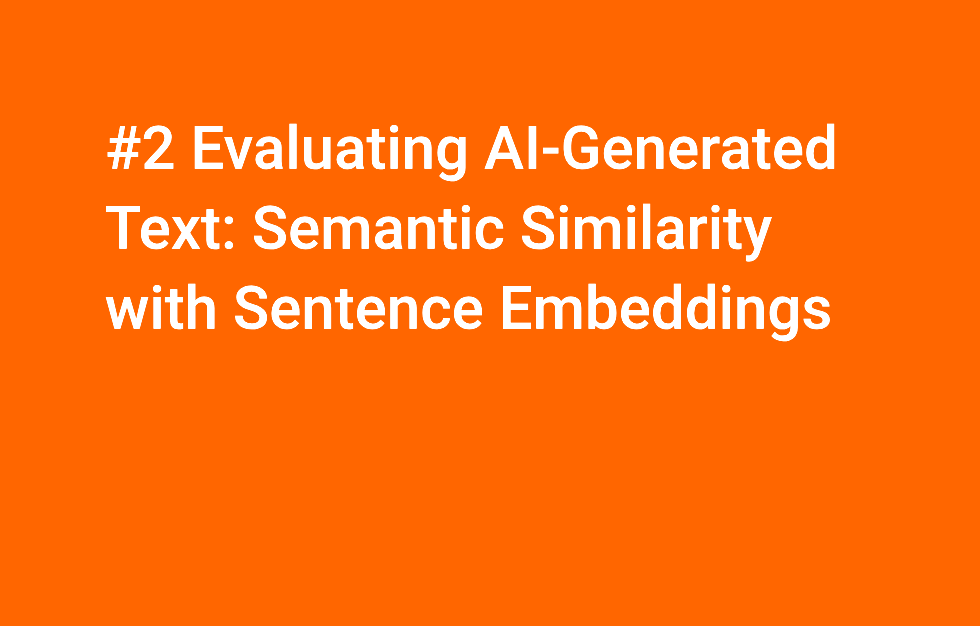

# ia_spacy_llm.md

## Intro
A post that explores the author's concerns about the potential downsides of artificial intelligence (AI). They express skepticism about AI's purported benefits, highlighting fears about its impact on the environment, the labor market, and the production of relevant, useful content. The author then focuses on the challenge of evaluating the quality of AI-generated text, specifically addressing how to ensure it is "correct" and avoids "hallucinations" - instances where AI produces inaccurate or nonsensical output. They introduce the concept of "sentence embeddings" as a potential solution, explaining how it allows for comparing sentences based on meaning rather than just words. The author then presents their approach for validating the quality of AI-generated text using the "spacy-llm" package, along with other tools like "pytextrank" and "pysentence-similarity," all with the goal of ensuring the usefulness of AI-generated content.

**You can read the article on my blog**
[Content Quality: How Sentence Embeddings Can Save AI-Generated Content and some other concerns on AI: Environmental Impact, Job Loss](https://wp.me/p3Vuhl-3mv)

 
## Audio version
This post is also an experiment to test NotebookLM. So, here is this regular blog post "Content Quality: How Sentence Embeddings Can Save AI-Generated Content and some other concerns on AI: Environmental Impact, Job Loss" converted into a podcast using NotebookLM.

[Blog Post Audio made with NotebookLM on "How Sentence Embeddings Can Save AI-Generated Content and some other concerns on AI: Environmental Impact, Job Loss"](https://on.soundcloud.com/61ufT6BNt4WzhvwX7)

# Videos

[Streamlit & Ollama: Querying Mistral LLM Locally and Generating Titles & Keywords](https://www.youtube.com/watch?v=gkc5OVaEcbg)

[Evaluating AI-Generated Text: Semantic Similarity with Sentence Embeddings](https://www.youtube.com/watch?v=OgIvs2eWwOM)
