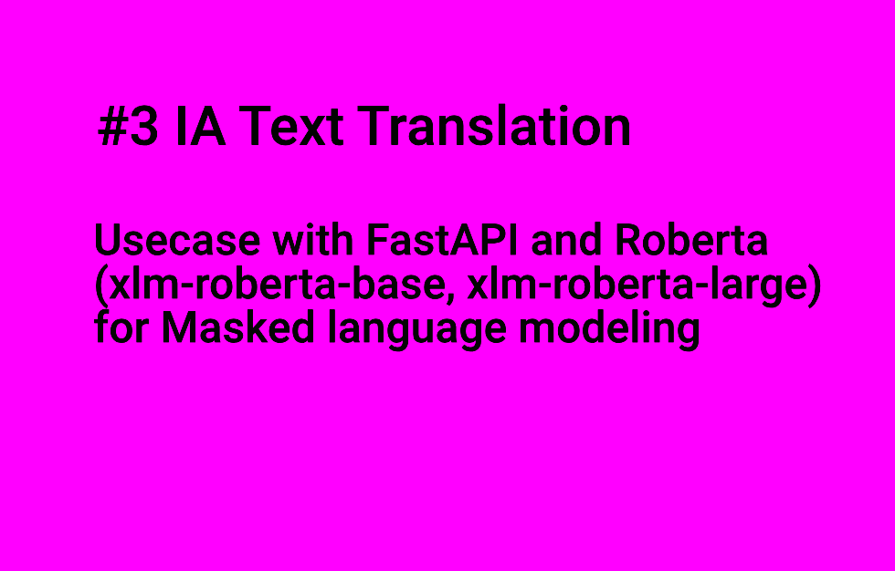

# ia_translation_gradio


## Introduction

**The post is released on my Blog**

Crafting Fluent Translation API: A quick Journey into Text Translation with NLLB, HuggingFace, and FastAPI, Plus a small Dive into Roberta Masked Language Modeling with Gradio. [https://flaven.fr/2023/11/crafting-fluent-translation-api-a-quick-journey-into-text-translation-with-nllb-huggingface-and-fastapi-plus-a-small-dive-into-roberta-masked-language-modeling-with-gradio/](https://flaven.fr/2023/11/crafting-fluent-translation-api-a-quick-journey-into-text-translation-with-nllb-huggingface-and-fastapi-plus-a-small-dive-into-roberta-masked-language-modeling-with-gradio/)


Some use cases for translation with IA and coincidently how to use No Language Left Behind (for instance `nllb-200-distilled-600M`), `transformers`, `langdetect` and `Gradio`. Also an attempt on gradio and my dear `FastAPI`!


## Usecases

- **001a_giladd123_nllb_fastapi:** 
An attempt using No Language Left Behind (for instance `nllb-200-distilled-600M`) aka `nllb` and `FastAPI` to offer an endpoint for translation
    
- **002_mlearning_ai:** 
Using `langdetect` and again some experiments with `nllb`
    
- **003_using_gradio:**
Using `Gradio`, some concepts + again for translation extracted from https://huggingface.co/spaces/Geonmo/nllb-translation-demo
    

**004_pyyush_maskedlanguagemodeling:**
A use case with `FastAPI` and `Roberta` (`xlm-roberta-base`, `xlm-roberta-large`) for Masked language modeling


## Videos

You can find my WALKTHROUGHS for these 3 videos walkthrough_ia_translation_gradio.diff (Video #1, Video #2, Video #3)


### Video #1

[IA Text Translation : Unlocking Multilingual Text Translation with NLLB, HuggingFace, and FastAPI and leverage on LangDetect Python Package](https://www.youtube.com/watch?v=WPX05gnL8UQ)[](https://www.youtube.com/watch?v=WPX05gnL8UQ)


### Video #2

[IA Text Translation : Revolutionize Translation Apps with Gradio: A Quick Guide to Building and Sharing Your Own Apps!](https://www.youtube.com/watch?v=G0ei9PX-Q1g)[](https://www.youtube.com/watch?v=G0ei9PX-Q1g)

### Video #3

[IA Text Translation : Usecase with FastAPI and Roberta (xlm-roberta-base, xlm-roberta-large) for Masked language modeling](https://www.youtube.com/watch?v=e5jubbwjLaQ)[](https://www.youtube.com/watch?v=e5jubbwjLaQ)

## More on `No Language Left Behind`

- No Language Left Behind (for instance nllb-200-distilled-600M) "Driving inclusion through the power of AI translation"
https://ai.meta.com/research/no-language-left-behind/


## Examples for `Masked Language Modeling` with `Roberta` with `Gradio`

Possible illustration of "Biais" linked to the training: `Roberta` guesses the capital of Oregon but misses that of Uganda due to lack of appropriate training.

```bash
[MASK] is the capital of Oregon.
# For sure, everybody knows that the correct answer is "Portland" and the probability to have "Portland" as a proposition is close to one!
# Portland 94%
# This 2%
# Washington 1%
# Seattle 1%
# It 0%
```


![[MASK] is the capital of Oregon - Examples for Masked Language Modeling with Roberta with Gradio](https://github.com/bflaven/ia_usages/blob/main/ia_translation_gradio/gradio_Masked_Language_Modeling_oregon.png)

```bash
[MASK] is the capital and largest city of Uganda.
# For sure, everybody knows that the correct answer is "Kampala" and the probability to have "Kampala" as a proposition is not even in the propositions!

# Juba 25% Juba is the capital and largest city of South Sudan. 
# Uganda 14%
# Beni 8% A city in the Democratic Republic of Congo
# Nairobi 6% Nairobi is the capital and largest city of Kenya.
# It 6%
```

![[MASK] is the capital and largest city of Uganda - Examples for Masked Language Modeling with Roberta with Gradio](https://github.com/bflaven/ia_usages/blob/main/ia_translation_gradio/gradio_Masked_Language_Modeling_uganda.png)


**GIT COMMANDS REMINDER**

```bash

# go to the directory
cd /Users/brunoflaven/Documents/03_git/ia_usages/

cd /Users/brunoflaven/Documents/03_git/ia_usages/ia_translation_gradio/004_pyyush_maskedlanguagemodeling

# remove git stuff
ls -la
rm -R .git

# know your branch
git branch


# check for status
git status


# for any change just type this command
git add .

# add a commit with a message
git commit -am "add usecase"
git commit -am "add files"
git commit -am "update files"
git commit -am "add files and update readme"
git commit -am "add to .svg the Musk\'s Favorite Letter X"
git commit -am "add .gitignore"
git commit -am "add docker files"


# push to github if your branch on github is master
# git push origin master
git push

# Repair Permissions
cd /Users/brunoflaven/Documents/03_git/ia_usages
# groupname is staff on a mac
sudo chgrp -R groupname .
sudo chmod -R g+rwX .
sudo find . -type d -exec chmod g+s '{}' +


```
