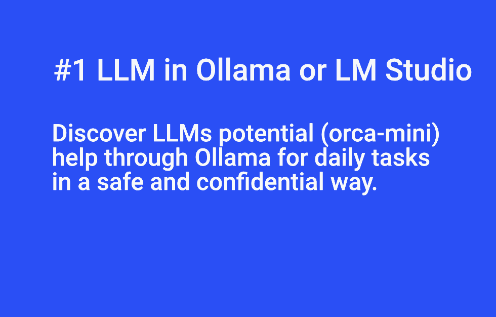
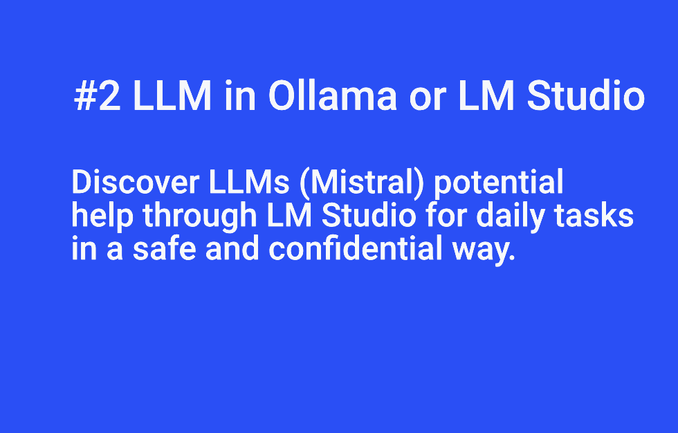

# ia_using_other_llm


**How to load LLM (falcon, llama2, mistral, mixtral, orca-mini...etc) on a local machine e.g Mac, PC with LM Studio and Ollama**


[Read more on flaven.fr: https://flaven.fr/2023/12/empower-your-workflow-harnessing-the-power-of-lm-studio-and-ollama-for-seamless-local-llm-execution/](https://flaven.fr/2023/12/empower-your-workflow-harnessing-the-power-of-lm-studio-and-ollama-for-seamless-local-llm-execution/)

## REQUIREMENTS

**Loading LLM with ollama.ai or lmstudio.ai.**

I found 2 great tools to query LLMs confidentially and securely. The only remark the only remark that this calls for is that lmstudio is much more UX friendly than ollama.

- [https://ollama.ai/](https://ollama.ai/)
- [https://lmstudio.ai/](https://lmstudio.ai/)


## EXPLANATIONS
Some explanations for the files avalaible in this directory: 

- Modelfile_advanced_llama2: Prompt Model for Ollama
- Modelfile_llama2: Prompt Model for Ollama
- Modelfile_orca-mini: Prompt Model for Ollama
- README.md: This readme
- lm_studio_try_1.png: Below a screen capture from a prompt made in LM Studio 
- math_problem_arthur.py: Python conversion from a basic mathematical problem made with Mistral
- prompts_mistral_public.md: Some prompts made on Mistral both for teenagers problems and professional issues.
- samwit_basic.py: extract from https://github.com/samwit/langchain-tutorials/tree/382e8db4dc5e01fc400bee8d4146cb1a2e9c3150/ollama by Sam Witteveen. Slightly change to work with orca-mini and not llama2
- samwit_basic_chain.py: ditto
- samwit_rag.py: ditto

**Convert a UAT made with Cypress into a gherkin to enable migration to another testing framework e.g PlayWright (https://playwright.dev) or simply the Q/A workchain**

 or simply the Q/A workchain")


### commands for Ollama

You can find other info at [https://github.com/jmorganca/ollama](https://github.com/jmorganca/ollama)


```bash
# COMMANDS

# To run and chat with Llama 2
ollama run llama2
ollama run orca-mini
ollama run mistral:text
ollama run falcon:7b


# To run and chat with orca-mini
ollama pull llama2
ollama pull orca-mini

# remove a model
ollama rm llama2
ollama rm orca-mini
ollama rm mistral
ollama rm falcon:7b
ollama rm mistral:text
ollama rm orca-mini:latest


# list the model
ollama list


# when you are in the model you can use
>>> /?
>>> /list
>>> /set verbose

# to get out from the model
/exit

# create a custom prompt
# you need to create a file for your model named "hotwater". It look like a file
ollama create hotwater - ./hotwater

# ollama create [modelFileName] - ./[modelFileName]

```

## VIDEOS

Main title: 

Subtitle:
Discover LLMs potential (orca-mini) 
help through Ollama for daily tasks 
in a safe and confidential way


### Video #1 Using LLM in Ollama or LM Studio: Discover LLMs potential (orca-mini) help through Ollama for daily tasks in a safe and confidential way

[Video #1 Using LLM in Ollama or LM Studio: Discover LLMs potential (orca-mini) help through Ollama for daily tasks in a safe and confidential way](https://www.youtube.com/watch?v=LULqXhM5guk)[](https://www.youtube.com/watch?v=LULqXhM5guk)


### Video #2 Using LLM in Ollama or LM Studio: Discover LLMs potential (orca-mini) help through Ollama for daily tasks in a safe and confidential way

[Video #2 Using LLM in Ollama or LM Studio: Discover LLMs (Mistral) potential help through LM Studio for daily tasks in a safe and confidential way.](https://www.youtube.com/watch?v=tjpj41yrgro)[](https://www.youtube.com/watch?v=tjpj41yrgro)

**Video Tutorial: Using Ollama and LMM "orca-mini" on Mac M2**

**Step 1: Downloading Ollama from Ollama.ai**
- Open your web browser and navigate to [Ollama.ai](https://ollama.ai/).
- Find the "Download" section and choose the Mac M2 version.
- Once downloaded, locate the file in your Downloads folder.

**Step 2: Installing LMM "orca-mini" by Microsoft**
- Open the Terminal on your Mac M2.
- Navigate to https://ollama.ai/ and download Ollama.
- Install LMM "orca-mini" using the following command.
  ```bash
  ollama run orca-mini
  ```
  
**Step 3: Running Ollama Commands in the Terminal**
- In the Terminal, use the provided Ollama commands.
  ```bash
  ollama run llama2
  ollama run llama2-uncensored
  ollama run orca-mini
  ```

**Step 4: Using Ollama Commands in the Model**
- Inside the model, execute commands like:
  ```python
  >>> /?
  >>> /list
  >>> /set verbose
  ```

**Step 5: Removing Models and Listing Models**
- Use the following commands to remove or list models.
  ```bash
  ollama rm llama2
  ollama rm orca-mini
  ollama list
  ```

**Step 6: Performing Prompts on the Terminal**
- Directly in the Terminal, issue prompts:
  ```bash
  # Example prompts
  Tell me 5 facts about Roman history:
  Tell me 3 facts about Ludwig Wittgenstein:
  Give me a short geographical description with a maximum of 10 lines of the country Argentina:
  ```

**Step 7: Using Langchain for Prompts**
- Utilize Langchain for prompts in the Terminal.
  ```python
  llm("Tell me 5 facts about Roman history:")
  llm("Tell me 3 facts about Ludwig Wittgenstein:")
  llm("Give me a short geographical description with a maximum of 10 lines of the country Argentina:")
  ```

**Conclusion:**
- Showcase how seamlessly Ollama and LMM "orca-mini" can be integrated into your workflow, enabling powerful natural language processing and model-based prompts in the Terminal.


**Video Tutorial: Streamlining Daily Tasks with LM Studio and Mistral AI**

**Introduction:**
- Begin the video with an introduction to the concept of leveraging AI to assist with daily tasks.
- Highlight the benefits of using LM Studio and Mistral AI for automation and assistance.

**Step 1: Downloading LM Studio on Mac M2**
1. Open your web browser and navigate to lmstudio.ai.
2. Click on the "Download" section and choose the Mac M2 version.
3. Once the download is complete, locate the downloaded file in your Downloads folder.
4. Double-click on the file to start the installation process.
5. Follow the on-screen instructions to complete the installation.

**Step 2: Installing LLM Mistral-7B-Instruct-v0.1 by Mistral AI**
1. Visit the Mistral AI website to find the LLM Mistral-7B-Instruct-v0.1 model.
2. Download the model file to your computer.
3. Open LM Studio and navigate to the "Models" section.
4. Click on "Import Model" and select the Mistral-7B-Instruct-v0.1 file.
5. Wait for the model to be imported and verified by LM Studio.

**Step 3: Using LM Studio for Daily Tasks**
1. Demonstrate how to initiate prompts in LM Studio using Mistral AI's model.
2. Perform a prompt to convert a UAT testing file created with Cypress into a Gherkin file.
3. Show how LM Studio can be used to generate Python code for specific tasks.
4. Highlight the versatility of Mistral AI's model in assisting with various daily tasks.

**Step 4: Creating a Python File with AI Assistance**
1. Open a text editor and create a new Python file.
2. Demonstrate how to use LM Studio to generate Python code snippets for specific functionalities.
3. Discuss the time-saving aspect of using AI to assist in coding tasks.

**Conclusion:**
- Summarize the key points of the tutorial.
- Emphasize how LM Studio and Mistral AI can be valuable tools in streamlining daily tasks and freeing up time for more important activities.
- Encourage viewers to explore and experiment with the capabilities of LM Studio for their specific needs.

**Outro:**
- Provide links to LM Studio (lmstudio.ai) and Mistral AI for viewers to explore further.
- Invite viewers to like, comment, and subscribe for more tutorials on leveraging AI for productivity.

