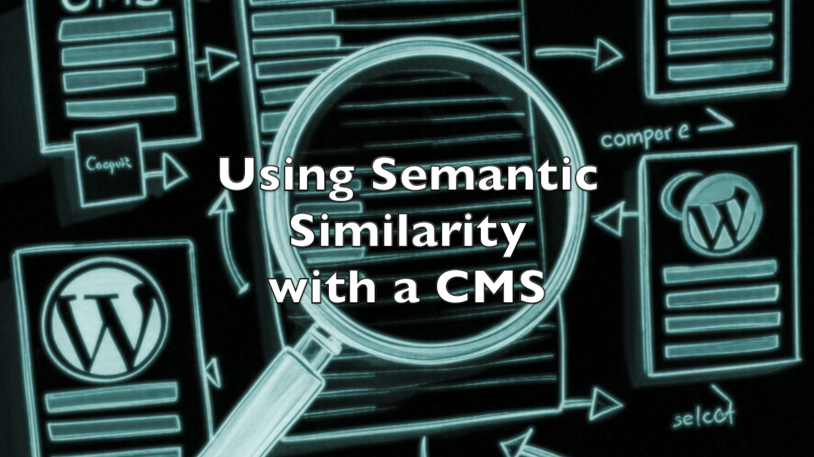
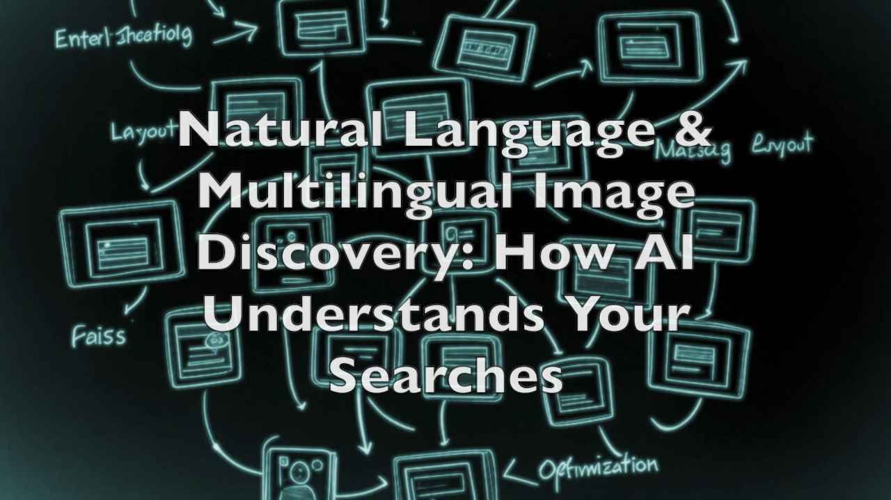
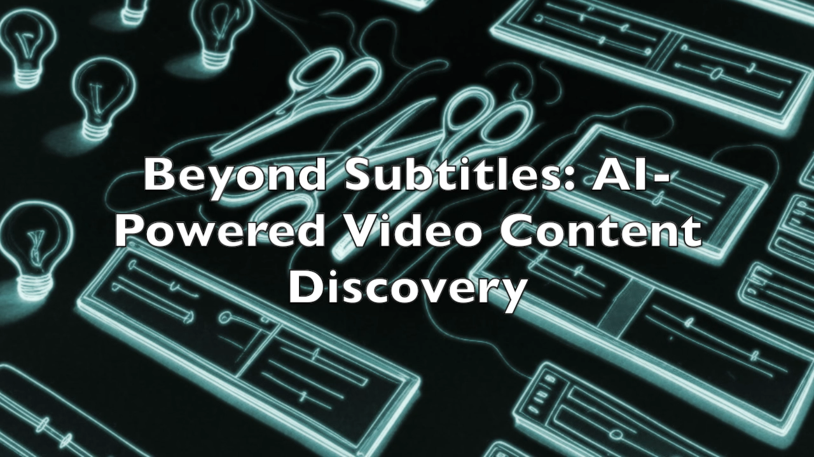

# ia_video_editing_faiss_compare_keywords.md

Breadcrumbs of Innovation: A Snapshot of AI Explorations

Exploring cutting-edge AI technologies has been an exciting journey as we step into 2025. Here's a glimpse into my recent technological adventures:

## 🔍 Key AI Exploration Topics:
1. IA_CMS: Semantic Similarity in Content Management
2. IA_Faiss: Advanced Text and Image Ordering Techniques
3. IA_Video_Editing: Innovative Editing with Streamlit and Spacy
4. Special Focus: AI's Influence on the 2025 US Presidential Election

## 🎙️ Dive Deeper:
- Podcast Explorations: 
  [The Big Dive part 1 : exploring reflections on the impact of artificial intelligence (AI)](https://on.soundcloud.com/KYsxEU7Zh1qdDLGo8)
  [The Big Dive part 2 : The 2025 US presidential election through the lens of "We Have Never Been Woke," a book critiquing a new "woke" elite.](https://on.soundcloud.com/THjokmLiH8q194Gr9)

## 📝 Full Details:
- Blog Post: Breadcrumbs of Innovation: A Snapshot of AI Explorations [https://wp.me/p3Vuhl-3mP](https://wp.me/p3Vuhl-3mP)
- - Code Repository: [GitHub Link](https://shorturl.at/y5HNV)

💡 Pro Tip: The prompts are often more valuable than the code itself!

#AI #LLM #Mistral #Faiss #CLIP #ChatGPT #Perplexity #Claude #Innovation2025

## 1. ia_cms: Using semantic similarity with a CMS
The underlying user story for this code is straightforward: to establish a semantic match between all existing keywords in a CMS (such as WordPress, Drupal, or a custom-built CMS) and a list of AI-generated keywords using prompts (e.g., with Claude, Mistral, or ChatGPT). The goal is to generate a refined list of existing keywords based on the AI's suggestions for the editorial team.

The code utilizes the **SentenceTransformer('all-MiniLM-L6-v2')** model to achieve this semantic matching effectively.

## 2. ia_faiss: Using faiss

### Simplistic Explanation of Faiss:
Faiss is a tool that helps find similarities between things like text or images, even when the dataset is huge. It works very fast, even for large files that don’t fit in your computer's memory. It uses smart algorithms to compare and group items efficiently and can work with Python or on the GPU for speed.

- More on "Faiss": https://github.com/facebookresearch/faiss

---

### Use Case Connections:

#### **Use Case #1: Text Ordering**
Faiss is used with the **"all-MiniLM-L6-v2"** model to quickly rank and organize text titles. It helps pick the best title from a list by understanding how similar each one is to the ideal choice.

#### **Use Case #2: Image Ordering**
Faiss works with **CLIP** (a tool that connects text and images) to sort images based on their relevance to a user’s multilingual text input. For example, if a user searches "beautiful sunset," it finds the most suitable image from a collection, even if the text is in different languages.

#### Use Case #3:  Unrelated Use Case: Image Descriptions
A separate method using **face_recognition** and **transformers** creates accurate descriptions for images. These descriptions can improve image search or provide useful alternative text (alt messages) for accessibility. For instance, it might describe an image as "A smiling person at the beach during sunset," which is helpful for users and search engines.

- More on "CLIP, Connecting text and images" at https://openai.com/index/clip/ and "open_clip" at https://github.com/mlfoundations/open_clip

## 3. ia_video_editing: Attempt using streamlit and spacy to make video editing
 
### Explanation:
This app helps analyze text from a transcription file (exported as JSON from Whisper). It uses a tool called SpaCy to find important information like "Detected Entities" (e.g., names, places), "Key Phrases" (important topics), and "Text Segments" (specific parts of the text). For each of these, it shows the time when they start (cue point IN) and end (cue point OUT) in the audio or video.

---

### User Story:
**As a** content creator or video editor,  
**I want** an app that analyzes transcriptions from my audio or video files,  
**So that** I can easily find key moments (like when important topics or entities are mentioned) and use the timecodes to edit or navigate my content efficiently.

## Audio version
This post is also an experiment to test NotebookLM. So, here is this regular blog post "Breadcrumbs of Innovation: A Snapshot of AI Explorations" [https://wp.me/p3Vuhl-3mP](https://wp.me/p3Vuhl-3mP) converted into a podcast using NotebookLM.

- [The Big Dive part 1 : exploring reflections on the impact of artificial intelligence (AI)](https://on.soundcloud.com/KYsxEU7Zh1qdDLGo8)

- [The Big Dive part 2 : The 2025 US presidential election through the lens of "We Have Never Been Woke," a book critiquing a new "woke" elite.](https://on.soundcloud.com/THjokmLiH8q194Gr9)

## Video

[Using Semantic Similarity with a CMS #ia #nlp #cms #api #python](https://www.youtube.com/watch?v=xjf1xogmvp4)

[Combining Face Recognition and Image Captioning: A Comprehensive Guide #python #ia](https://www.youtube.com/watch?v=nPmrj9mBc-0)

[Natural Language & Multilingual Image Discovery: How AI Understands Your Searches](https://www.youtube.com/watch?v=SJ8FaKZUiUI)

[Beyond Subtitles: AI-Powered Video Content Discovery #ia #nlp #spacy #whisper #streamlit #python](https://www.youtube.com/watch?v=gblpFYX4Wqg)

