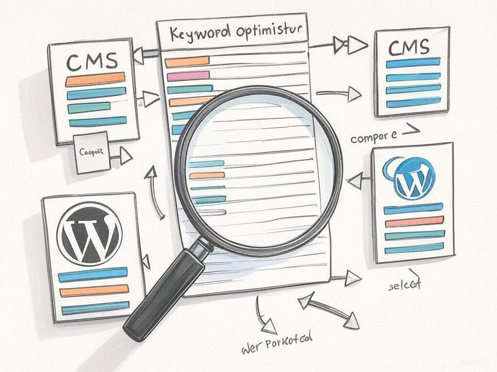

# ia_cms

## 1. ia_cms: Using semantic similarity with a CMS
The underlying user story for this code is straightforward: to establish a semantic match between all existing keywords in a CMS (such as WordPress, Drupal, or a custom-built CMS) and a list of AI-generated keywords using prompts (e.g., with Claude, Mistral, or ChatGPT). The goal is to generate a refined list of existing keywords based on the AI's suggestions for the editorial team.

The code utilizes the **SentenceTransformer('all-MiniLM-L6-v2')** model to achieve this semantic matching effectively.

**Illustration made with Grok for "Using semantic similarity with a CMS"**

