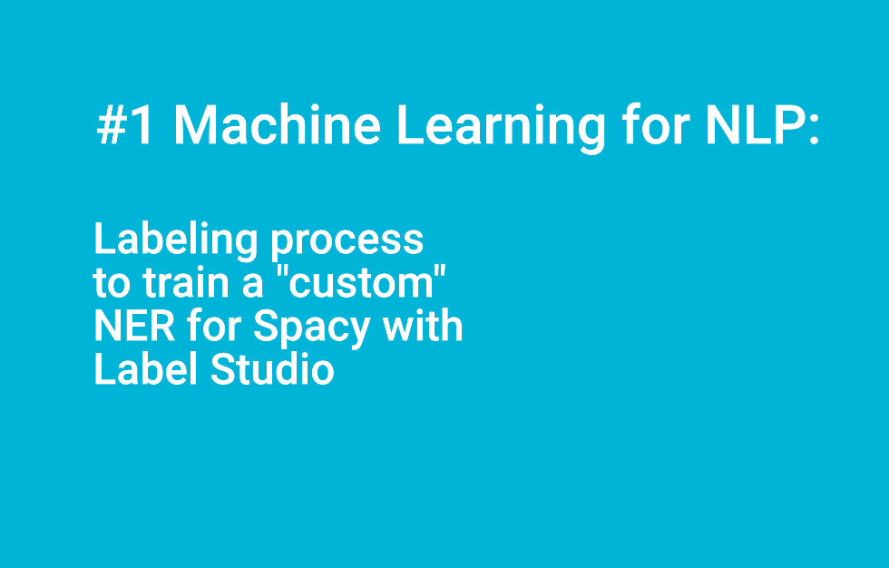
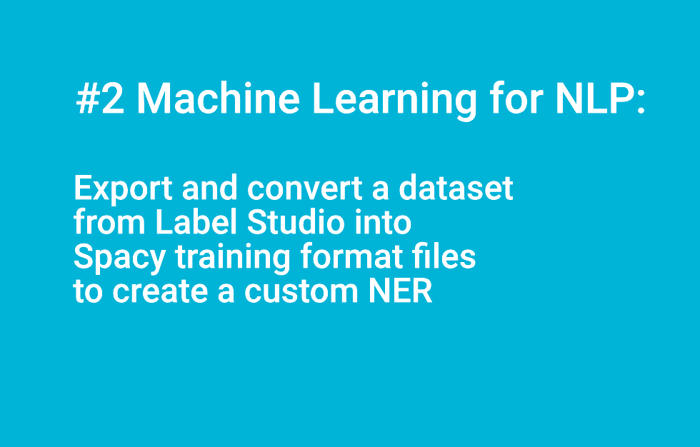
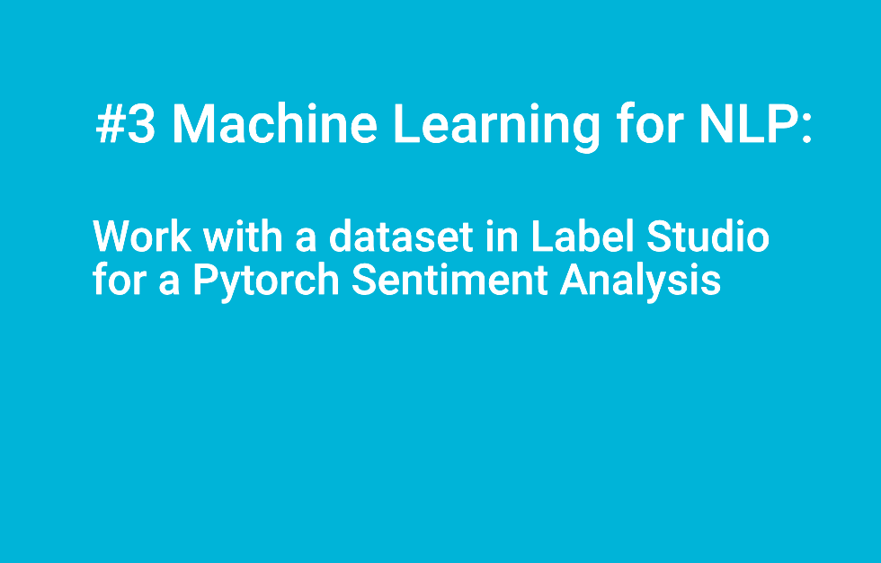
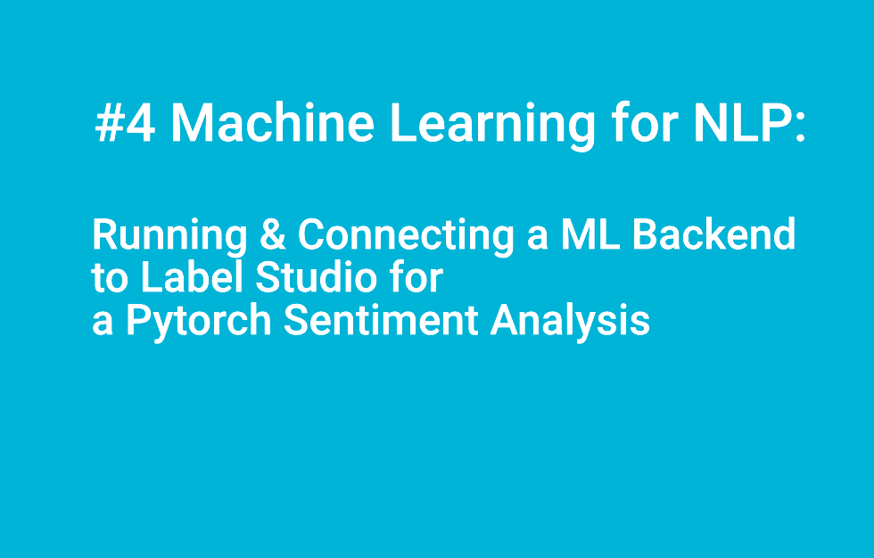

# ml_label_studio

**Below, a quick description for each content: mix of directories and files.**

- 00_kw_extractor_spacy_linguistic_features : a simple keywords extractor made with Spacy.

- 01_spacy_tagging_entity_extraction: some examples found on the web to explore Custom NER, NLP notions...etc

- 02_using_label_studio: how-to use Label Studio.

- 03_using_label_studio_spacy: convert data from label studio format to Spacy format.

- 04_label_studio_source_text_file: some text files to test annotating.

- A-common-pipeline-for-annotating-data-and-building-models-with-machine-learning.png: picture describing a common pipeline for annotating data and building models with machine learning.

- labeling_process.png: picture describing the "simplest" Labeling Process with 6 Steps.

- labeling_process_small.png: same picture but small format published in the post.

- requirements_ml_with_label_studio.txt: requirements to manage the anaconda environment to use Label Studio.

- requirements_tagging_entity_extraction.txt: requirements to manage the anaconda environment to use Spacy for custom NER.

[The importance of the Labeling process or annotating inside an ML pipeline plus an example with NER made for Spacy
](https://flaven.fr/2023/08/the-importance-of-the-labeling-process-or-annotating-inside-an-ml-pipeline-plus-an-example-with-ner-made-for-spacy/)


**The order of this readme reflects the chaotic path of my progression which goes from the specific to the general as often.**

*Starting from case studies on how to create a "custom" NER or Named Entity Recognition for Spacy, I wanted to understand the creation of .conllu files and treebanks, files which are based on Spacy. The crucial knot is being able to make annotations in order to eventually create these files. One thing led to another, I ended up establishing a viable pipeline in ML/IA. So from exploring Spacy, I went directly to the alternative annotation applications to Prodigy (https://prodi.gy/) looking for a free alternatives like Doccano (https://github.com/doccano /doccano) or especially Label Studio (https://labelstud.io/) & Dagshub (https://dagshub.com/dashboard).*


## VIDEOS

You can find my WALKTHROUGHS for these four videos walkthrough_ml_label_studio_spacy_custom_ner.diff (Video #1, Video #2) and walkthrough_ml_label_studio_annotation_server.diff (Video #3, Video #4)


[#1 Machine Learning for NLP: Labeling process to train a "custom" NER for Spacy with Label Studio](https://www.youtube.com/watch?v=5QwPKZFZZW0)[](https://www.youtube.com/watch?v=5QwPKZFZZW0)

[#2 Machine Learning for NLP: Export & convert data from Label Studio to Spacy training format to create a custom NER](https://www.youtube.com/watch?v=RO33OEkeOTg)[](https://www.youtube.com/watch?v=RO33OEkeOTg)

[#3 Machine Learning for NLP: Work with a dataset in Label Studio for a Pytorch Sentiment Analysis](https://www.youtube.com/watch?v=NVVbfVHgS_I)[](https://www.youtube.com/watch?v=NVVbfVHgS_I)


[#4 Machine Learning for NLP: Running & Connecting a ML Backend to Label Studio for a Pytorch Sentiment Analysis](https://www.youtube.com/watch?v=d1VR4UiMFDE)[](https://www.youtube.com/watch?v=d1VR4UiMFDE)
 
## OTHER RESSOURCES

**Below some projects that I have explore for this post.**

The other elements in the readme are responding to FOMO syndrome and are just here for the record.

### Project :: TM2TB
**tm2tb is a term extraction module with a focus on bilingual data.**

https://www.tm2tb.com/
https://github.com/luismond/tm2tb

### SPACY :: Project Templates from spaCy

**spaCy projects let you manage and share end-to-end spaCy workflows for different use cases and domains, and orchestrate training, packaging and serving your custom pipelines.**

https://spacy.io/usage/projects
https://github.com/explosion/projects

#### EXAMPLES_FROM_SPACY

- source: https://github.com/explosion/projects/tree/v3

- blog: https://explosion.ai/blog


**INSTALL**

```
# go to dir
cd /Users/brunoflaven/Documents/01_work/blog_articles/
git clone https://github.com/explosion/projects.git examples_from_spacy

# required packages
pip install spacy-streamlit

# go to path
cd /Users/brunoflaven/Documents/01_work/blog_articles/spacy_examples_from_spacy/

# REQUIREMENT_1 :: DO NOT FORGET TO INSTALL THE REQUIRED PACKAGES
# to install
pip install -r tagging_entity_extraction.txt


# REQUIREMENT_2 :: ACTIVATE VIRTUAL ENVIRONMENT
source activate tagging_entity_extraction

# MODEL python -m spacy project clone tutorials/ner_fashion_brands

```


**(1) EXAMPLE_1: TUTORIAL_NER_FASHION_BRANDS**
```

# STEP_1 :: Clone the project template you want to use
python -m spacy project clone tutorials/ner_fashion_brands _testing_projects/ner_fashion_brands

# STEP_2 :: Go to the dir and fetch assets
cd examples_from_spacy/_testing_projects/ner_fashion_brands

# STEP_3
python -m spacy project run preprocess


# STEP_4
python -m spacy project run all

# STEP_5 
python -m spacy project run visualize-data
```


**(2) EXAMPLE_2: INTEGRATIONS_STREAMLIT**
```

# STEP_1 :: Clone the project template you want to use
python -m spacy project clone integrations/streamlit _testing_projects/integrations_streamlit

# STEP_2 :: Go to the dir and fetch assets
cd _testing_projects/integrations_streamlit

# to export requirements
pip freeze > requirements.txt

# to install
pip install -r requirements.txt


# STEP_3 :: the commands are defined in "commands:" inside project.yml
# command_1
python -m spacy project run download

# command_2
python -m spacy project run visualize
```


**(3) EXAMPLE_3: PIPELINES_NER_DEMO_REPLACE**
```

# STEP_1 :: Clone the project template you want to use
# Note be sure to be in the correct directory :: cd /Users/brunoflaven/Documents/01_work/blog_articles/spacy_examples_from_spacy

python -m spacy project clone pipelines/ner_demo_replace _testing_projects/ner_demo_replace

# To fetch the assets, run:
# Note be sure to be in the correct directory :: cd /Users/brunoflaven/Documents/01_work/blog_articles/spacy_examples_from_spacy
python -m spacy project assets _testing_projects/ner_demo_replace


# STEP_2 :: Go to the dir and fetch assets
cd _testing_projects/ner_demo_replace

# to export requirements
pip freeze > requirements.txt

# to install
pip install -r requirements.txt

# STEP_3 :: Run all
# Note be sure to be in the correct directory :: cd /Users/brunoflaven/Documents/01_work/blog_articles/spacy_examples_from_spacy/_testing_projects/ner_demo_replace

cd _testing_projects/ner_demo_replace
python -m spacy project run all

# STEP_4 :: visualize command
python -m spacy project run visualize-model

# UPDATE STREAMLIT
pip install streamlit --upgrade
```

**(3) EXAMPLE_3:  SPANCAT_FOOD_INGREDIENTS (require prodigy, use Label Studio instead)**

```
# no way to install
python -m pip install prodigy -f https://XXXX-XXXX-XXXX-XXXX@download.prodi.gy


# STEP_1 :: Clone the project template you want to use
# Note be sure to be in the correct directory :: 
cd /Users/brunoflaven/Documents/01_work/blog_articles/spacy_examples_from_spacy

python -m spacy project clone tutorials/spancat_food_ingredients _testing_projects/spancat_food_ingredients

# STEP_2 :: To fetch the assets
# Note be sure to be in the correct directory :: cd /Users/brunoflaven/Documents/01_work/blog_articles/spacy_examples_from_spacy

cd /Users/brunoflaven/Documents/01_work/blog_articles/spacy_examples_from_spacy
python -m spacy project assets _testing_projects/spancat_food_ingredients


# STEP_3 :: Run command
# Go to the directory
cd _testing_projects/spancat_food_ingredients
python -m spacy project run all

# Go to the directory
cd _testing_projects/spancat_food_ingredients

# decompose commands
python -m spacy project run download	

# Download the required spaCy model.
python -m spacy project run span_manual	

# Mark entity spans in a text by highlighting them and selecting the respective labels.
python -m spacy project run span_manual_pattern	

# Mark entity spans in a text with patterns.
python -m spacy project run train_spancat	

# Train a spancat model.
python -m spacy project run span_correct	

# Correct entity spans predicted by the trained spancat model.
python -m spacy project run db_drop	

# Drop the prodigy database defined in the project.yml
python -m spacy project run db_export

```


**(4) EXAMPLE_4:  NER_DOUBLE**
```
# Note be sure to be in the correct directory ::
cd /Users/brunoflaven/Documents/01_work/blog_articles/spacy_examples_from_spacy

# STEP_1 CLONE
python -m spacy project clone tutorials/ner_double _testing_projects/ner_double

# STEP_2 ASSETS
python -m spacy project assets _testing_projects/ner_double

# STEP_3
python -m spacy project run all
python -m spacy validate
python -m spacy project run assemble	
python -m spacy project run package	
python -m spacy project run check	
	
	
# TO UPDATE LANGUAGE PACKAGES
python -m spacy download de_core_news_md
python -m spacy download fr_core_news_md
python -m spacy download pt_core_news_md
python -m spacy download it_core_news_md

```


**(5) EXAMPLE_5:  EDIT_TREE_LEMMATIZER for Dutch**
```
# Made with Dutch
# Note be sure to be in the correct directory :: 
cd /Users/brunoflaven/Documents/01_work/blog_articles/spacy_examples_from_spacy

# STEP_1 CLONE
python -m spacy project clone pipelines/edit_tree_lemmatizer _testing_projects/edit_tree_lemmatizer

# STEP_2 FETCHING ASSET
# If not in the directory
python -m spacy project assets _testing_projects/edit_tree_lemmatizer

# If in the directory
python -m spacy project assets

# STEP_3 RUN
cd _testing_projects/edit_tree_lemmatizer/


# Command all steps
# command_all :: python -m spacy project run  all	

# Command for each step, you can run separately the command
# command_1 ::  python -m spacy project run preprocess
# command_2 ::  python -m spacy project run create-config
# command_3 ::  python -m spacy project run train
# command_4 :: python -m spacy project run evaluate

# MODEL python -m spacy train config.cfg --paths.train ./train.spacy --paths.dev ./dev.spacy


# the training for Dutch
training/UD_Dutch-Alpino/model-last

# Dutch
# ik ben ziek :: je suis malade
# Expert toont aan: van iets nieuws beginnen word je gelukkig :: Spectacles d'experts : commencer quelque chose de nouveau rend heureux
# Source: https://www.telegraaf.nl/

```

**(6) EXAMPLE_6:  PARSER_DEMO**

```
# go to dir
cd /Users/brunoflaven/Documents/01_work/blog_articles/spacy_examples_from_spacy/

# STEP_1 CLONE
python -m spacy project clone pipelines/parser_demo _testing_projects/parser_demo

# STEP_2 FETCHING ASSET
! If not in the directory
python -m spacy project assets _testing_projects/parser_demo
! If in the directory
python -m spacy project assets

# STEP_3 RUN
cd _testing_projects/parser_demo/


# command All steps
# command_all :: python -m spacy project run all	
# command_1:: python -m spacy project run visualize-model


```

```
# OTHER EXAMPLES FOR SPACY
nel_emerson
ner_double
ner_drugs
ner_fashion_brands
ner_food_ingredients
ner_multiple_trials
ner_pytorch_medical
ner_tweets
parser_low_resource
rel_component
spancat_food_ingredients
spanruler_restaurant_reviews
textcat_docs_issues
textcat_goemotions
```


## Label Studio :: label-studio-ml-tutorial
- Source: https://labelstud.io/blog/introduction-to-machine-learning-with-label-studio/

- Code: https://github.com/HumanSignal/label-studio-ml-tutorial


## Label Studio :: What is the Label Studio ML backend?

- Source: https://labelstud.io/blog/introduction-to-machine-learning-with-label-studio/


- Code: https://github.com/HumanSignal/label-studio-ml-backend


## DagsHub :: Automate the Labeling Process with Label Studio and DagsHub

- https://www.youtube.com/watch?v=VBnhpMLpBB0
- https://dagshub.com/yonomitt/RelaxML
- https://dagshub.com/DagsHub/TinySquirrelDataset

